---
## Front matter
lang: ru-RU
title: Лабораторная работа №1
subtitle: Система контроля Git
author:
  - Смирнов-Мальцев Е. Д.
institute:
  - Российский университет дружбы народов им. Патриса Лумумбу, Москва, Россия
date: 10 февраля 2024

## i18n babel
babel-lang: russian
babel-otherlangs: english

## Formatting pdf
toc: false
toc-title: Содержание
slide_level: 2
aspectratio: 169
section-titles: true
theme: metropolis
header-includes:
 - \metroset{progressbar=frametitle,sectionpage=progressbar,numbering=fraction}
 - '\makeatletter'
 - '\beamer@ignorenonframefalse'
 - '\makeatother'

style: |
  section h2 {
    text-align: center;
  }

---

# Цель работы

Познакомится с системой Git.

---

# Задание

Провести базовую настройку Git, создать репозиторий и исследовать различные возможности системы.

---

# Теоретическое введение

Git - это свободное распространяема система контроля версий. Она предназначена для быстрой и эффективной обработки проектов любого размера.

---

# Выполнение лабораторной работы

Установил все переводы строк текстовых файлов в главном репозитории одинаковыми. Поставил флаг для избежания нечитаемых строк.

## 

---

# Выполнение лабораторной работы

Создал файл Hello.html, инициализировал репозиторий и закоммитил файл.

## 

---

# Выполнение лабораторной работы

Отредактировал файл Hello.html, проиндексировал изменения и закоммитил их.

## 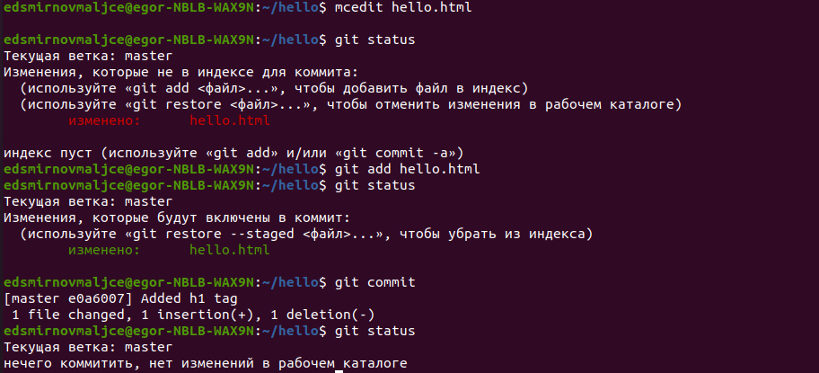

---

# Выполнение лабораторной работы

Еще раз изменил этот файл, проиндексировал его, не закоммитив изменил его еще раз и проверил статус репозитория.

## 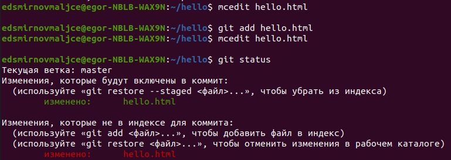

---

# Выполнение лабораторной работы

Закоммитил проиндексированные изменения и проверил статус репозитория.

## 

---

# Выполнение лабораторной работы

Вывел сохраненные версии репозитория.

## 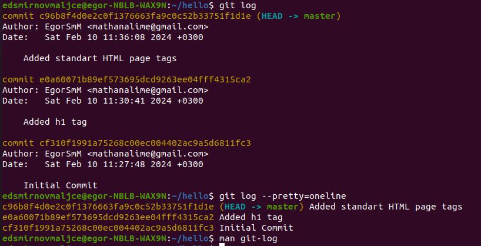

---

# Выполнение лабораторной работы

Перешел в первую версию репозитория.

## 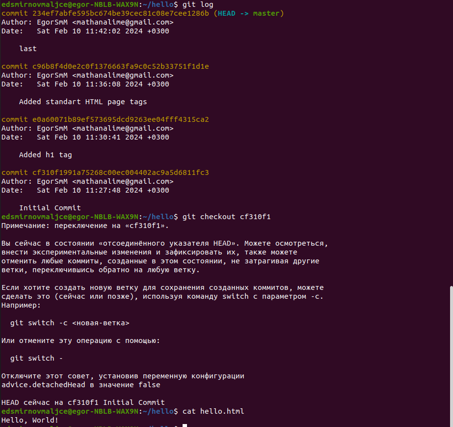

---

# Выполнение лабораторной работы

Вернулся в последнюю версию репозитория.

## 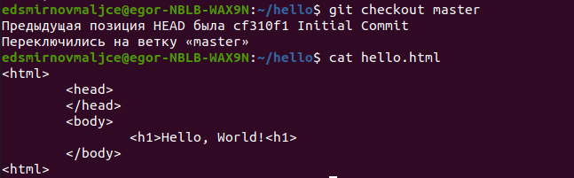

---

# Выполнение лабораторной работы

Пометил ее тэгом, перешел в предпоследнюю версию и пометил ее тоже.

## 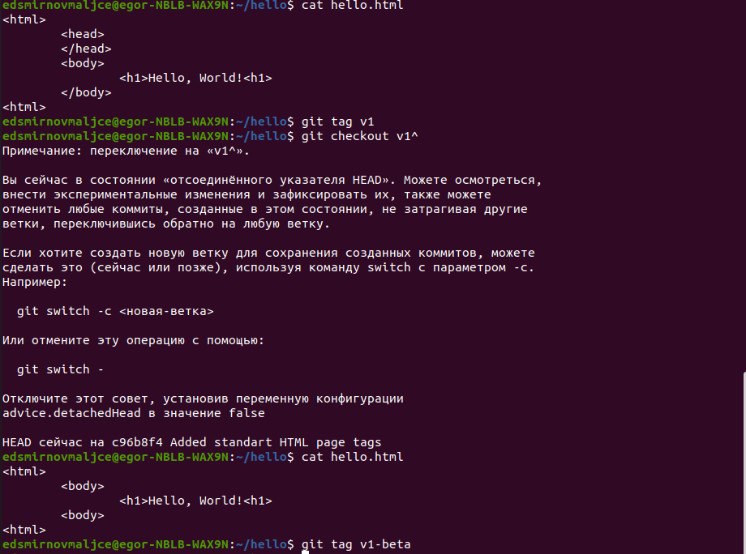

---

# Выполнение лабораторной работы

Проверил у каких версий стоят тэги.

## 

---

# Выполнение лабораторной работы

Изменил hello.html и без коммита перешел к текуще версии файла. Изменения пропали.

## 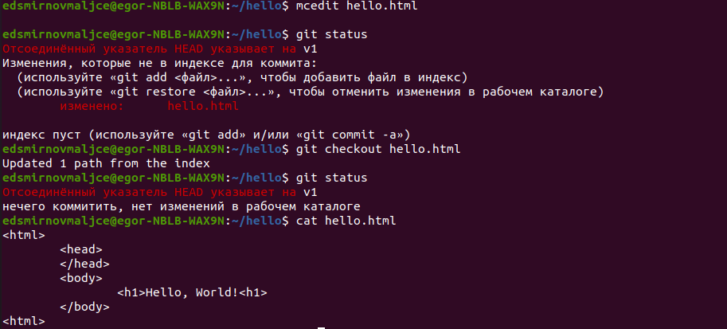

---

# Выполнение лабораторной работы

Изменил файл Hello.html, проиндексировав его и откатился к предыдущей версии.

## 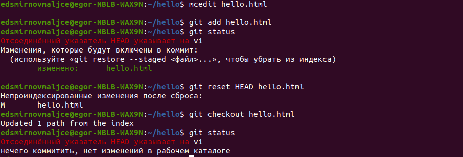

---

# Выполнение лабораторной работы

Изменил файл Hello.html, закоммитил изменения и откатился к предыдущей версии.

## 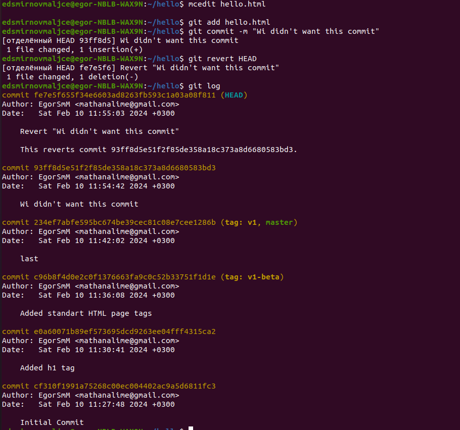

---

# Выполнение лабораторной работы

Пометил тэгом произведенные в предыдущем шаге изменения и перешел к правильной версии.

## 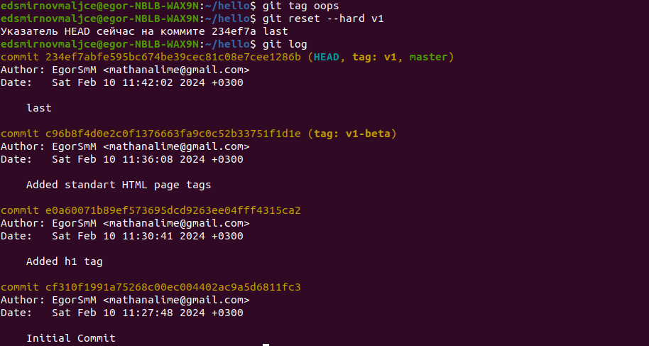

---

# Выполнение лабораторной работы

Удалил неправильные версии.

## 

---

# Выполнение лабораторной работы

Изменил файл и добавил изменения в уже существующий коммит.

## 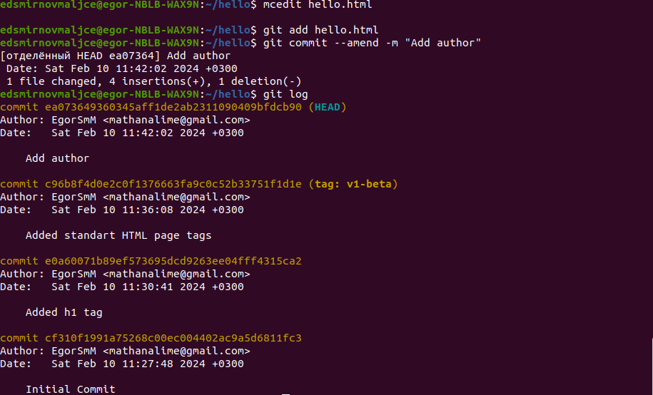

---

# Выполнение лабораторной работы

Создал папку и перенес в нее файл.

## 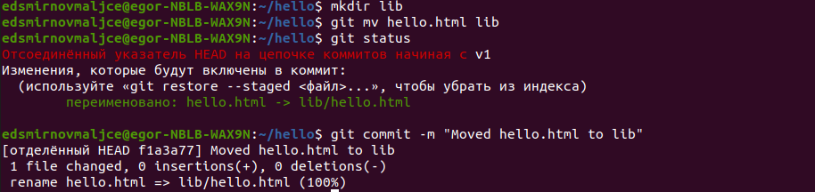

---

# Выполнение лабораторной работы

Создал файл index.html.

## 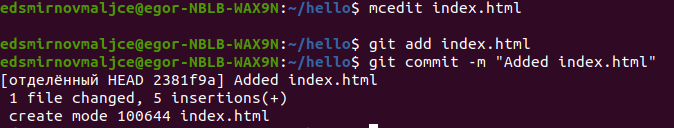

---

# Выполнение лабораторной работы

Изучил данные, хранящиеся в папке .git.

## 

---

# Выполнение лабораторной работы

Открыл хэш дерева.

## 

---

# Выполнение лабораторной работы

Открыл нужную версию файла по хэшу.

## 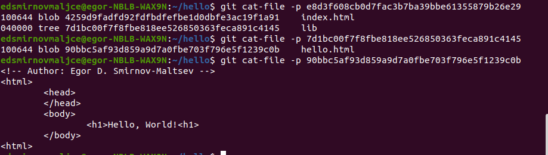

---

# Выполнение лабораторной работы

Создал новую ветку и в ней закоммитил новый файл.

## 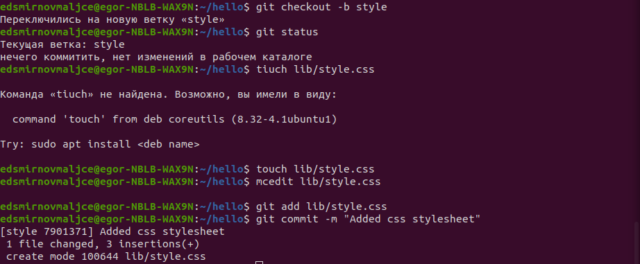

---

# Выполнение лабораторной работы

Изменил остальные файлы в новой ветке.

## 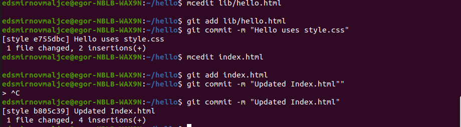

---

# Выполнение лабораторной работы

Попереключался между ветками.

## 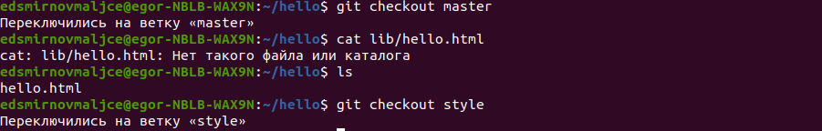

---

# Выполнение лабораторной работы

Произвел изменения в старой ветке.

## 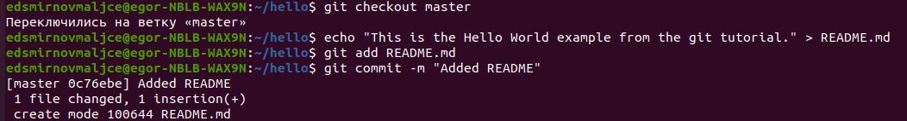

---

# Выполнение лабораторной работы

Просмотрел текущее дерево репозитория.

## 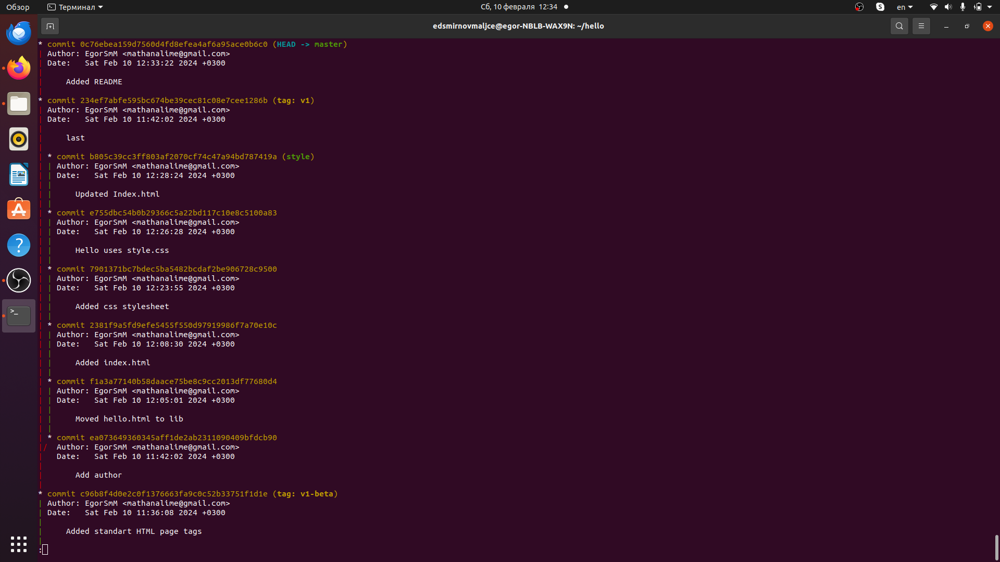
 
---

# Выводы

С помощью системы Git можно запоминать произведенные изменения и создавать различны ветки изменений.