---
## Front matter
title: "Отчет по лабораторной работе №1"
subtitle: "Работа с Git"
author: "Смирнов-Мальцев Егор Дмитриевич"

## Generic otions
lang: ru-RU
toc-title: "Содержание"

## Bibliography
bibliography: bib/cite.bib
csl: pandoc/csl/gost-r-7-0-5-2008-numeric.csl

## Pdf output format
toc: true # Table of contents
toc-depth: 2
lof: true # List of figures
lot: true # List of tables
fontsize: 12pt
linestretch: 1.5
papersize: a4
documentclass: scrreprt
## I18n polyglossia
polyglossia-lang:
  name: russian
  options:
	- spelling=modern
	- babelshorthands=true
polyglossia-otherlangs:
  name: english
## I18n babel
babel-lang: russian
babel-otherlangs: english
## Fonts
mainfont: PT Serif
romanfont: PT Serif
sansfont: PT Sans
monofont: PT Mono
mainfontoptions: Ligatures=TeX
romanfontoptions: Ligatures=TeX
sansfontoptions: Ligatures=TeX,Scale=MatchLowercase
monofontoptions: Scale=MatchLowercase,Scale=0.9
## Biblatex
biblatex: true
biblio-style: "gost-numeric"
biblatexoptions:
  - parentracker=true
  - backend=biber
  - hyperref=auto
  - language=auto
  - autolang=other*
  - citestyle=gost-numeric
## Pandoc-crossref LaTeX customization
figureTitle: "Рис."
tableTitle: "Таблица"
listingTitle: "Листинг"
lofTitle: "Список иллюстраций"
lotTitle: "Список таблиц"
lolTitle: "Листинги"
## Misc options
indent: true
header-includes:
  - \usepackage{indentfirst}
  - \usepackage{float} # keep figures where there are in the text
  - \floatplacement{figure}{H} # keep figures where there are in the text
---

# Цель работы

Познакомится с системой Git.

# Задание

Провести базовую настройку Git, создать репозиторий и исследовать различные возможности системы.

# Теоретическое введение

Git - это свободное распространяема система контроля версий. Она предназначена для быстрой и эффективной обработки проектов любого размера.

# Выполнение лабораторной работы

Установил все переводы строк текстовых файлов в главном репозитории одинаковыми. Поставил флаг для избежания нечитаемых строк (рис. [-@fig:001]).

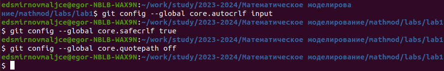{ #fig:001 width=70% }

Создал файл Hello.html, инициализировал репозиторий и закоммитил файл (рис. [-@fig:002]).

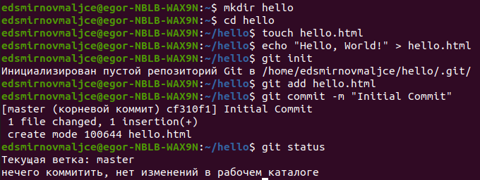{ #fig:002 width=70% }

Отредактировал файл Hello.html, проиндексировал изменения и закоммитил их (рис. [-@fig:003]).

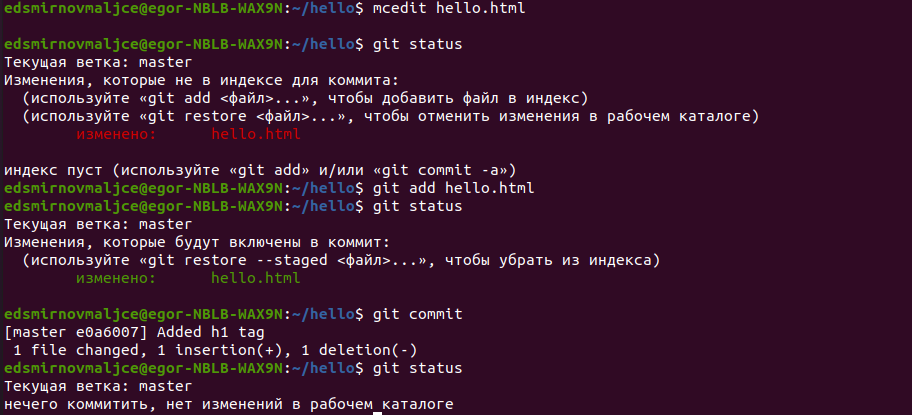{ #fig:003 width=70% }

Еще раз изменил этот файл, проиндексировал его, не закоммитив изменил его еще раз и проверил статус репозитория (рис. [-@fig:004]).

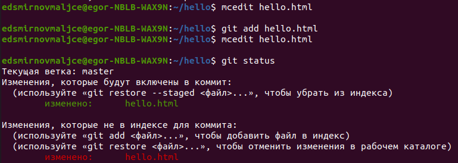{ #fig:004 width=70% }

Закоммитил проиндексированные изменения и проверил статус репозитория (рис. [-@fig:005]).

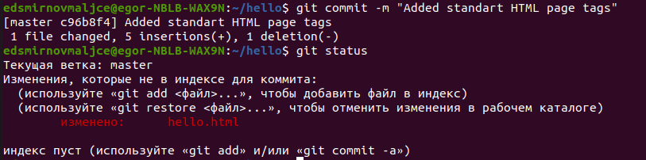{ #fig:005 width=70% }

Вывел сохраненные версии репозитория (рис. [-@fig:006]).

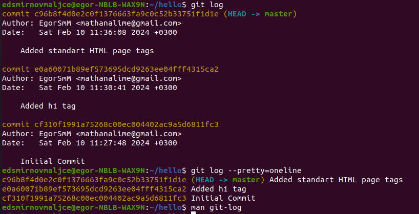{ #fig:006 width=70% }

Перешел в первую версию репозитория (рис. [-@fig:007]).

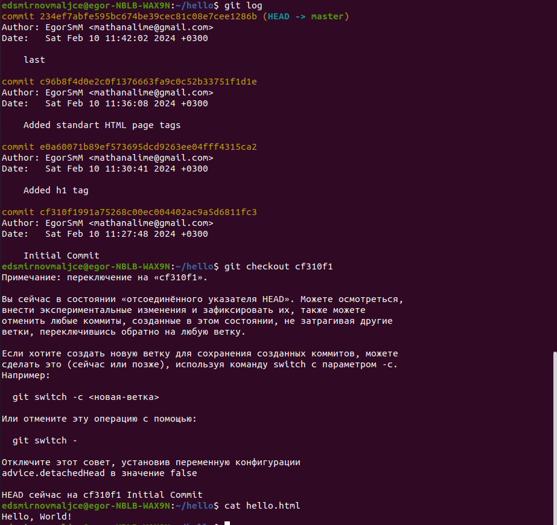{ #fig:007 width=70% }

Вернулся в последнюю версию репозитория (рис. [-@fig:008]).

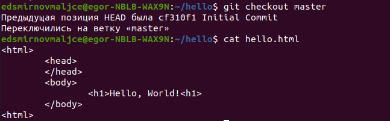{ #fig:008 width=70% }

Пометил ее тэгом, перешел в предпоследнюю версию и пометил ее тоже. (рис. [-@fig:009]).

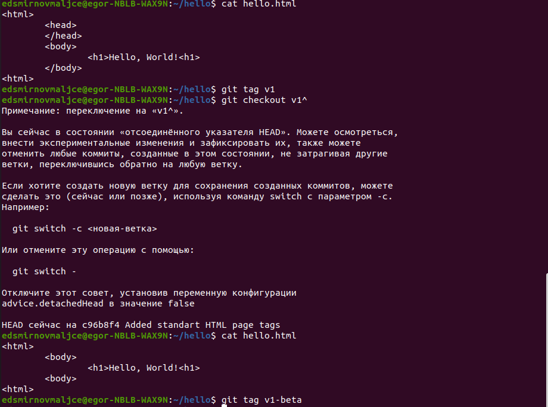{ #fig:009 width=70% }

Проверил у каких версий стоят тэги (рис. [-@fig:010]).

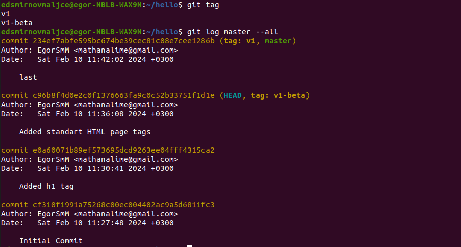{ #fig:010 width=70% }

Изменил hello.html и без коммита перешел к текуще версии файла. Изменения пропали (рис. [-@fig:011]).

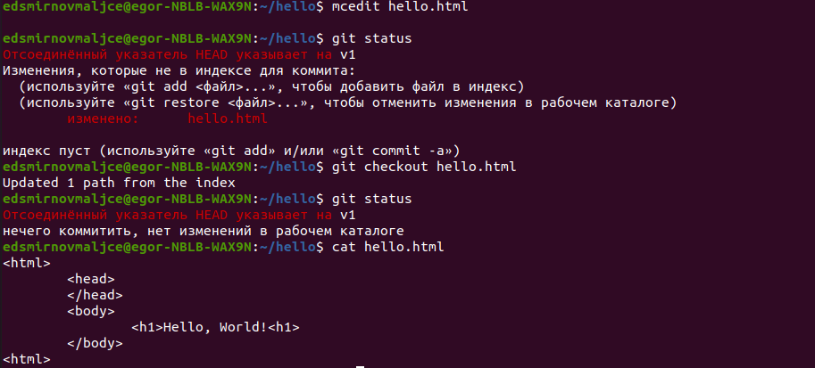{ #fig:011 width=70% }

Изменил файл Hello.html, проиндексировав его и откатился к предыдущей версии (рис. [-@fig:012]).

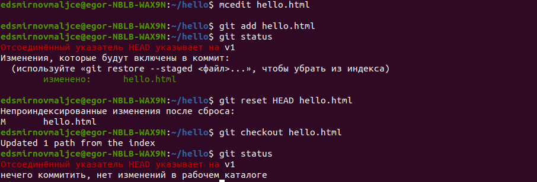{ #fig:012 width=70% }

Изменил файл Hello.html, закоммитил изменения и откатился к предыдущей версии (рис. [-@fig:013]).

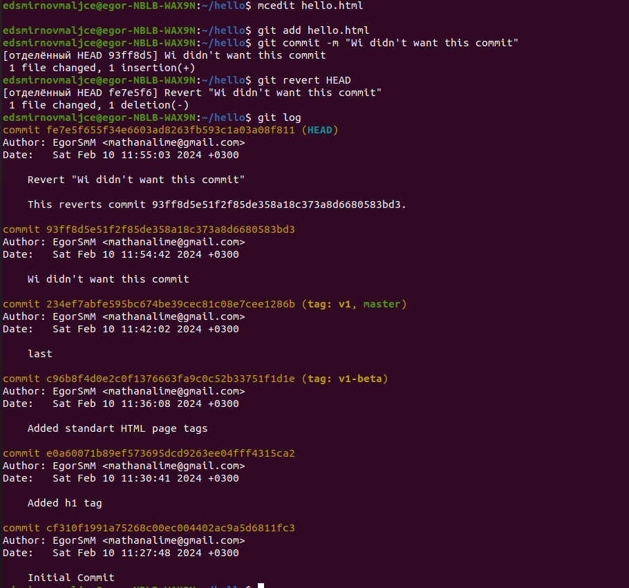{ #fig:013 width=70% }

Пометил тэгом произведенные в предыдущем шаге изменения и перешел к правильной версии (рис. [-@fig:014]).

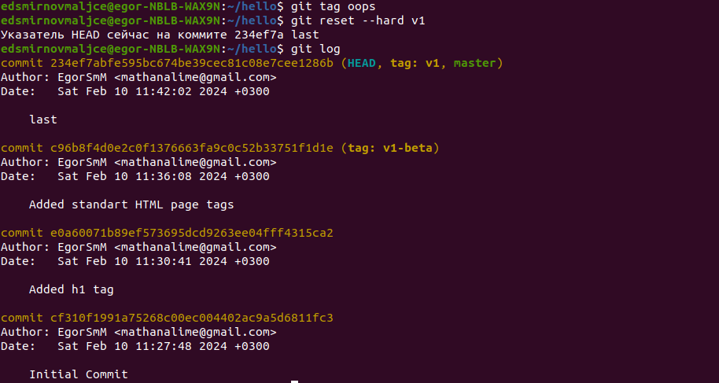{ #fig:014 width=70% }

Удалил неправильные версии (рис. [-@fig:015]).

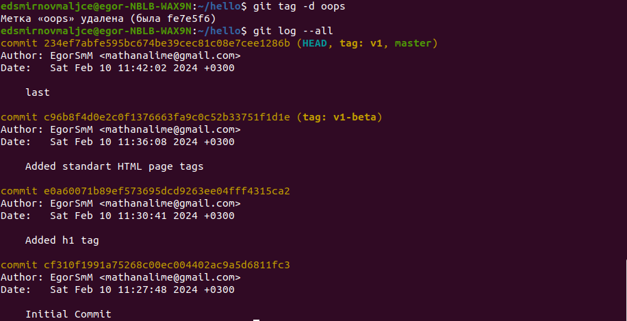{ #fig:015 width=70% }

Изменил файл и добавил изменения в уже существующий коммит (рис. [-@fig:016]).

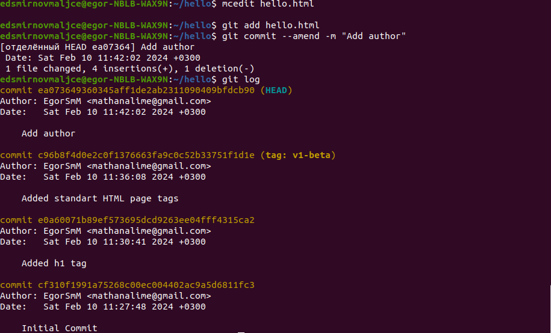{ #fig:016 width=70% }

Создал папку и перенес в нее файл (рис. [-@fig:017]).

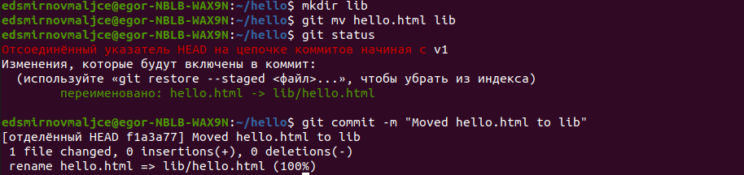{ #fig:017 width=70% }

Создал файл index.html (рис. [-@fig:018]).

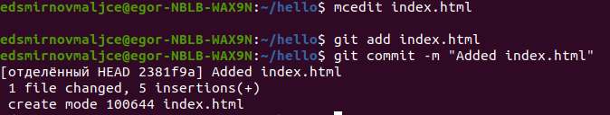{ #fig:018 width=70% }

Изучил данные, хранящиеся в папке .git (рис. [-@fig:019]).

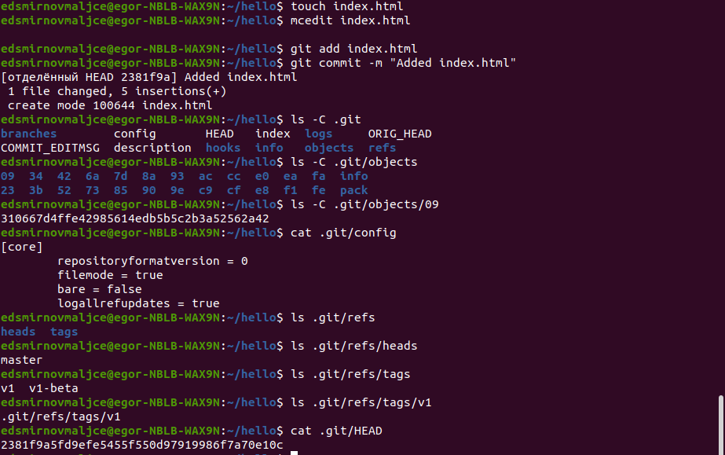{ #fig:019 width=70% }

Открыл хэш дерева (рис. [-@fig:020]).

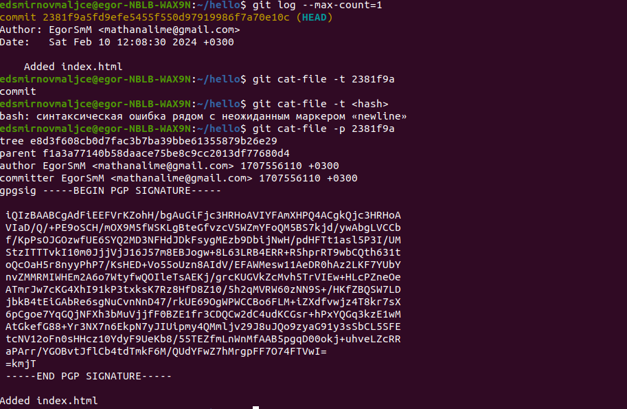{ #fig:020 width=70% }

Открыл нужную версию файла по хэшу (рис. [-@fig:021]).

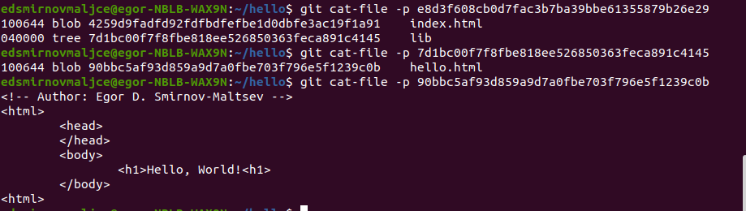{ #fig:021 width=70% }

Создал новую ветку и в ней закоммитил новый файл (рис. [-@fig:022]).

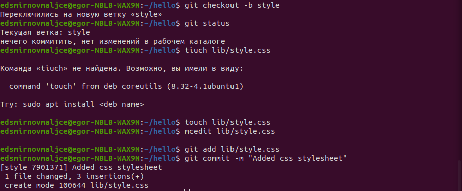{ #fig:022 width=70% }

Изменил остальные файлы в новой ветке (рис. [-@fig:023]).

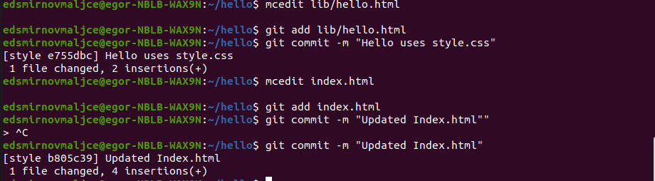{ #fig:023 width=70% }

Попереключался между ветками (рис. [-@fig:024]).

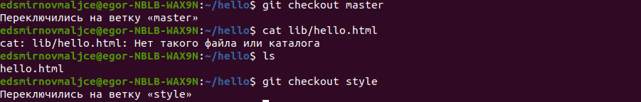{ #fig:024 width=70% }

Произвел изменения в старой ветке (рис. [-@fig:025]).

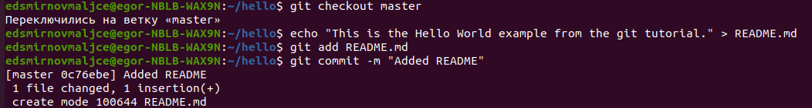{ #fig:025 width=70% }

Просмотрел текущее дерево репозитория (рис. [-@fig:026]).

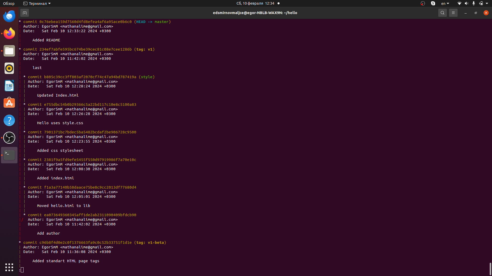{ #fig:026 width=70% }

# Выводы

С помощью системы Git можно запоминать произведенные изменения и создавать различны ветки изменений.

# Список литературы{.unnumbered}

::: {#refs}
:::
