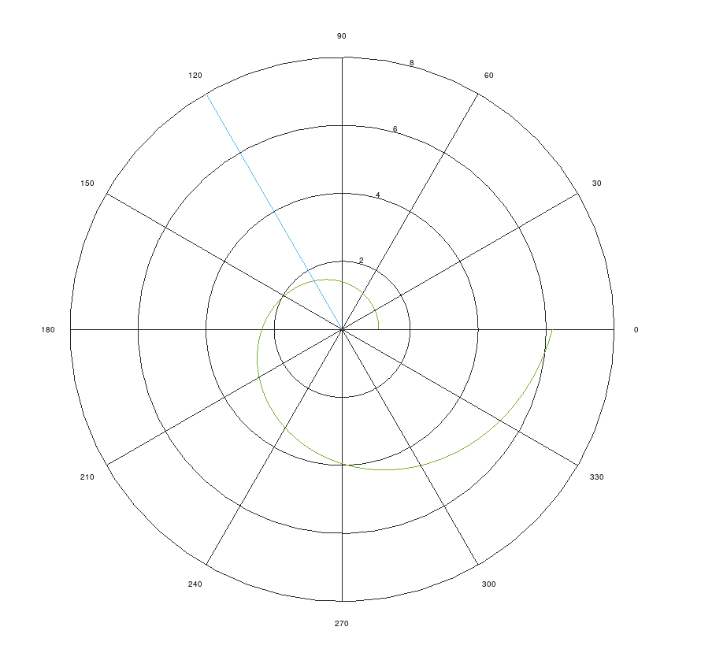
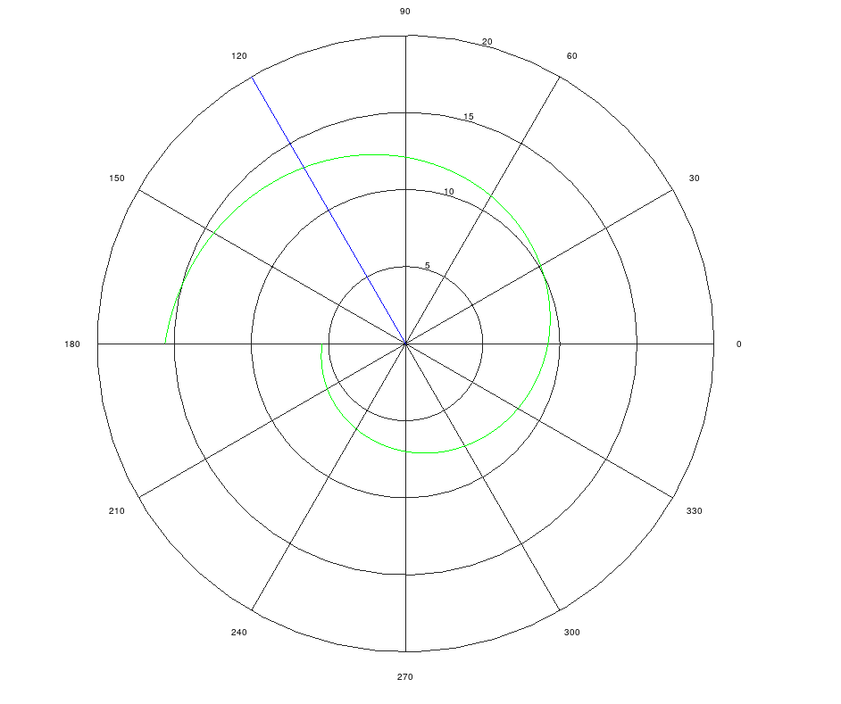

---
## Front matter
lang: ru-RU
title: Лабораторная работа №2
subtitle: Задача о погоне
author:
  - Смирнов-Мальцев Е. Д.
institute:
  - Российский университет дружбы народов им. Патриса Лумумбу, Москва, Россия
date: 17 февраля 2024

## i18n babel
babel-lang: russian
babel-otherlangs: english

## Formatting pdf
toc: false
toc-title: Содержание
slide_level: 2
aspectratio: 169
section-titles: true
theme: metropolis
header-includes:
 - \metroset{progressbar=frametitle,sectionpage=progressbar,numbering=fraction}
 - '\makeatletter'
 - '\beamer@ignorenonframefalse'
 - '\makeatother'

style: |
  section h2 {
    text-align: center;
  }
marp: true

---

# Цель работы

Определить траекторию, по которой следует двигаться преследователю, чтобы встретиться с преследуемым.

---

# Задание

На море в тумане катер береговой охраны преследует лодку браконьеров.
Через определенный промежуток времени туман рассеивается, и лодка
обнаруживается на расстоянии 16,2 км от катера. Затем лодка снова скрывается в
тумане и уходит прямолинейно в неизвестном направлении. Известно, что скорость
катера в 4 раза больше скорости браконьерской лодки.

1. Запишите уравнение, описывающее движение катера, с начальными
условиями для двух случаев (в зависимости от расположения катера
относительно лодки в начальный момент времени).
2. Постройте траекторию движения катера и лодки для двух случаев.
3. Найдите точку пересечения траектории катера и лодки.

---

# Теоретическое введение

Приведем один из примеров построения математических моделей для
выбора правильной стратегии при решении задач поиска.
Например, рассмотрим задачу преследования браконьеров береговой
охраной. На море в тумане катер береговой охраны преследует лодку браконьеров.
Через определенный промежуток времени туман рассеивается, и лодка
обнаруживается на расстоянии k км от катера. Затем лодка снова скрывается в
тумане и уходит прямолинейно в неизвестном направлении. Известно, что скорость
катера в 2 раза больше скорости браконьерской лодки.
Необходимо определить по какой траектории необходимо двигаться катеру,
чтоб нагнать лодку.

---

# Выполнение лабораторной работы

Пусть в начальный момент времени лодка браконьеров находится в центре полярной системы координат. А катер охраны находится в точке (0, 16.2). Мы хотим, чтобы расстояние от центра координат до лодки было такое же, как и от центра координат до катера. Потом уже мы сможем ловить браконьеров. Если лодка прошла расстояние $x$, то катер прошел $4x$. Но тогда катер находится либо на расстоянии $16.2-4x$, либо на расстоянии $-16.2+4x$. В первом случае получаем, что $x = 16.2 / 5$, а во втором $x = 16.2 / 3$.

---

# Выполнение лабораторной работы

Теперь скорость отдаления катера от центра должна быть равна скорости лодки. А тангенсальная скорость тогда будет равна скорости лодки, умноженную на корень из 15 по теореме Пифагора. Исходя из этого составляем дифференциальное уравнение и решаем его. Поскольку у нас было 2 случая, то мы получим 2 траектории.

---

# Выполнение лабораторной работы

## 

---

# Выполнение лабораторной работы

## 

---

# Выводы

Мы построили траекторию, по которой необходимо двигаться катеру.
