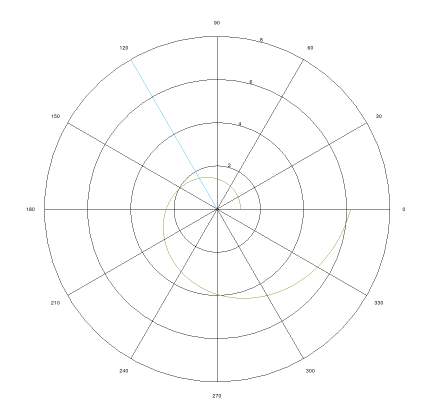
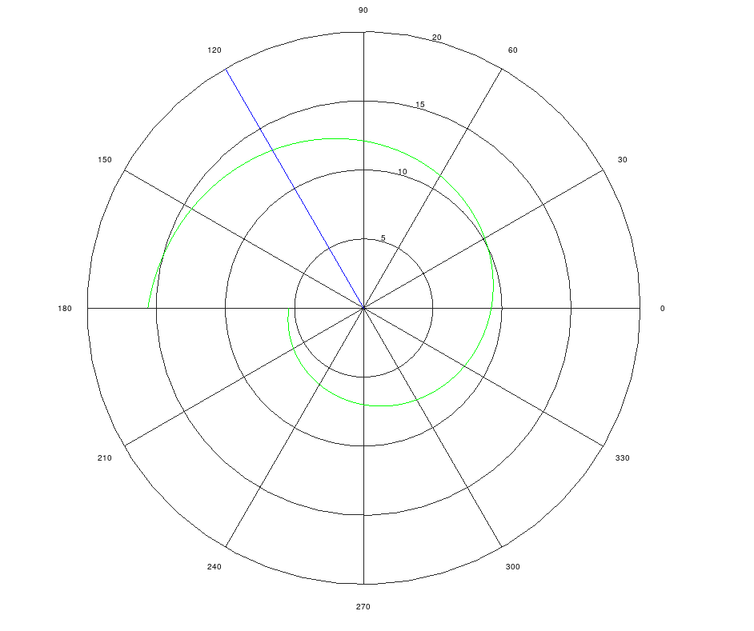

---
## Front matter
title: "Отчет по лабораторной работе №2"
subtitle: "Задача о погоне"
author: "Смирнов-Мальцев Егор Дмитриевич"

## Generic otions
lang: ru-RU
toc-title: "Содержание"

## Bibliography
bibliography: bib/cite.bib
csl: pandoc/csl/gost-r-7-0-5-2008-numeric.csl

## Pdf output format
toc: true # Table of contents
toc-depth: 2
lof: true # List of figures
lot: true # List of tables
fontsize: 12pt
linestretch: 1.5
papersize: a4
documentclass: scrreprt
## I18n polyglossia
polyglossia-lang:
  name: russian
  options:
	- spelling=modern
	- babelshorthands=true
polyglossia-otherlangs:
  name: english
## I18n babel
babel-lang: russian
babel-otherlangs: english
## Fonts
mainfont: PT Serif
romanfont: PT Serif
sansfont: PT Sans
monofont: PT Mono
mainfontoptions: Ligatures=TeX
romanfontoptions: Ligatures=TeX
sansfontoptions: Ligatures=TeX,Scale=MatchLowercase
monofontoptions: Scale=MatchLowercase,Scale=0.9
## Biblatex
biblatex: true
biblio-style: "gost-numeric"
biblatexoptions:
  - parentracker=true
  - backend=biber
  - hyperref=auto
  - language=auto
  - autolang=other*
  - citestyle=gost-numeric
## Pandoc-crossref LaTeX customization
figureTitle: "Рис."
tableTitle: "Таблица"
listingTitle: "Листинг"
lofTitle: "Список иллюстраций"
lotTitle: "Список таблиц"
lolTitle: "Листинги"
## Misc options
indent: true
header-includes:
  - \usepackage{indentfirst}
  - \usepackage{float} # keep figures where there are in the text
  - \floatplacement{figure}{H} # keep figures where there are in the text
---

# Цель работы

Определить траекторию, по которой следует двигаться преследователю, чтобы встретиться с преследуемым.

# Задание

На море в тумане катер береговой охраны преследует лодку браконьеров.
Через определенный промежуток времени туман рассеивается, и лодка
обнаруживается на расстоянии 16,2 км от катера. Затем лодка снова скрывается в
тумане и уходит прямолинейно в неизвестном направлении. Известно, что скорость
катера в 4 раза больше скорости браконьерской лодки.

1. Запишите уравнение, описывающее движение катера, с начальными
условиями для двух случаев (в зависимости от расположения катера
относительно лодки в начальный момент времени).
2. Постройте траекторию движения катера и лодки для двух случаев.
3. Найдите точку пересечения траектории катера и лодки.

# Теоретическое введение

Приведем один из примеров построения математических моделей для
выбора правильной стратегии при решении задач поиска.
Например, рассмотрим задачу преследования браконьеров береговой
охраной. На море в тумане катер береговой охраны преследует лодку браконьеров.
Через определенный промежуток времени туман рассеивается, и лодка
обнаруживается на расстоянии k км от катера. Затем лодка снова скрывается в
тумане и уходит прямолинейно в неизвестном направлении. Известно, что скорость
катера в 2 раза больше скорости браконьерской лодки.
Необходимо определить по какой траектории необходимо двигаться катеру,
чтоб нагнать лодку.

# Выполнение лабораторной работы

Пусть в начальный момент времени лодка браконьеров находится в центре полярной системы координат. А катер охраны находится в точке (0, 16.2). Мы хотим, чтобы расстояние от центра координат до лодки было такое же, как и от центра координат до катера. Потом уже мы сможем ловить браконьеров. Если лодка прошла расстояние $x$, то катер прошел $4x$. Но тогда катер находится либо на расстоянии $16.2-4x$, либо на расстоянии $-16.2+4x$. В первом случае получаем, что $x = 16.2 / 5$, а во втором $x = 16.2 / 3$.

Теперь скорость отдаления катера от центра должна быть равна скорости лодки. А тангенсальная скорость тогда будет равна скорости лодки, умноженную на корень из 15 по теореме Пифагора. Исходя из этого составляем дифференциальное уравнение и решаем его. Поскольку у нас было 2 случая, то мы получим 2 траектории (рис. [-@fig:001], [-@fig:002]).

{ #fig:001 width=70% }
{ #fig:002 width=70% }

# Выводы

Мы построили траекторию, по которой необходимо двигаться катеру.

# Список литературы{.unnumbered}

::: {#refs}
:::
