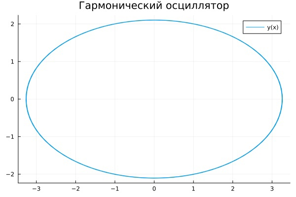
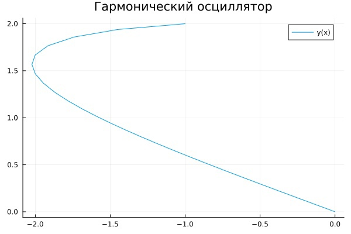
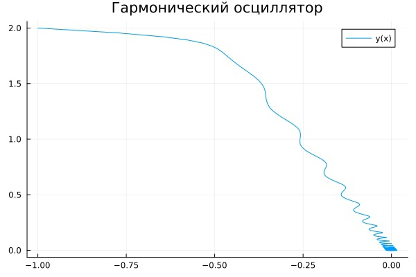
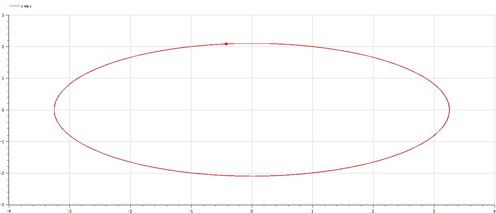
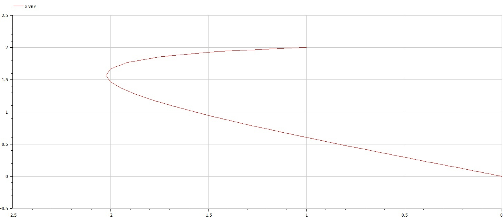
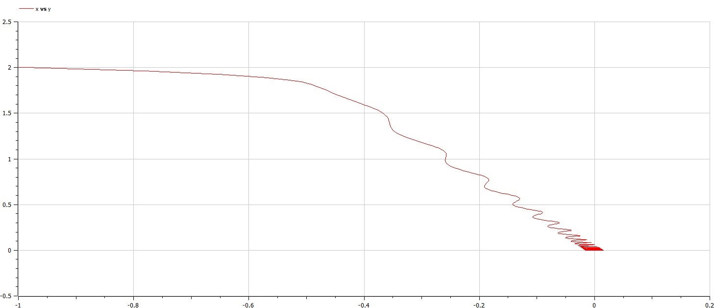

---
## Front matter
lang: ru-RU
title: Лабораторная работа №4
subtitle: Модель гармонических колебаний
author:
  - Смирнов-Мальцев Е. Д.
institute:
  - Российский университет дружбы народов им. Патриса Лумумбу, Москва, Россия
date: 24 февраля 2024

## i18n babel
babel-lang: russian
babel-otherlangs: english

## Formatting pdf
toc: false
toc-title: Содержание
slide_level: 2
aspectratio: 169
section-titles: true
theme: metropolis
header-includes:
 - \metroset{progressbar=frametitle,sectionpage=progressbar,numbering=fraction}
 - '\makeatletter'
 - '\beamer@ignorenonframefalse'
 - '\makeatother'


style: |
  section h2 {
    text-align: center;
  }
marp: true

---

# Цель работы

Построить фазовые портеты гармонических колебаний.

---

# Задание

Смоделировать гармонические колебание:

1. Без затухани и внешних сил.
2. С затуханием.
3. С затуханием и действием внешних сил.

---

# Теоретическое введение

Движение грузика на пружинке, маятника, заряда в электрическом контуре, а также эволюция во времени многих систем в физике, химии, биологии и других науках при определенных предположениях можно описать одним и тем же дифференциальным уравнением, которое в теории колебаний выступает в качестве
основной модели. Эта модель называется линейным гармоническим осциллятором. Уравнение свободных колебаний гармонического осциллятора имеет следующий вид:
$$
\ddot{x} + 2 \gamma \dot{x} + \omega_0^2 x = 0,
$$
где $x$ -- переменная, описывающая состояние системы (смещение грузика, заряд конденсатора и т.д.), $\gamma$ -- параметр, характеризующий потери энергии (трение в механической системе, сопротивление в контуре), $\omega_0$ -- собственная частота колебаний, t – время.

---

# Теоретическое введение

Это уравнение является линейным однородным дифференциальным уравнением второго порядка и примером линейной динамической системы. При отсутствии потерь в системе получаем уравнение консервативного осциллятора, энергия колебания которого сохраняется во времени.
$$
\ddot{x} + \omega_0^2 x = 0.
$$

Для однозначной разрешимости уравнения второго порядка необходимо задать два начальных условия вида
$$
\begin{cases}
 x(t_0) = x_0 \\
 \dot{x}(t_0)  = y_0.
\end{cases}
$$

---

# Теоретическое введение

Уравнение второго порядка можно представить в виде системы двух уравнений первого порядка:
$$
\begin{cases}
 \dot{x} = y \\
 \dot{y} = -\omega_0^2 x.
\end{cases}
$$

Начальные условия для этой системы примут вид:
$$
\begin{cases}
 x(t_0) = x_0 \\
 y(t_0)  = y_0.
\end{cases}
$$

---

# Теоретическое введение

Независимые переменные x, y определяют пространство, в котором «движется» решение. Это фазовое пространство системы. Поскольку оно двумерно, будем называть его фазовой плоскостью. Значение фазовых координат x, y в любой момент времени полностью определяет состояние системы. Решению уравнения движения как функции времени отвечает гладкая кривая в фазовой плоскости. Она называется фазовой траекторией. Если множество различных решений (соответствующих различным начальным условиям) изобразить на одной фазовой плоскости, возникает общая картина поведения системы. Такую картину, образованную набором фазовых траекторий, называют фазовым портретом

---

# Выполнение лабораторной работы

Выполнение лабораторной разобьем на два этапа:

1. Моделирование с помощью языка Julia.
2. Моделирование в программе Openmodelica.

---

# Моделирование в Julia

Для начала введем параметры задачи:

```Julia
w = 2.4;
g = 0;
t = (0, 60)
f(t) = 0
```

Переменная $w$ является квадратом частоты колебаний. Такой смысл был выбран, поскольку нам не дана частота колебаний, а дан сразу ее квадрат. Переменная $g$ характеризует потерю энергии. Переменная $t$ показывает сколько времени моделируется колебание. Функция $f$ характеризует влияние внешних сил.

---

# Моделирование в Julia

Далее введем систему дифференциальных уравнений, характеризующую нашу модель.

```Julia
function syst!(dx,x,p,t)
    dx[1] = x[2];
    dx[2] = -w.*x[1] - g .* x[2] - f(t);
end;
```

---

# Моделирование в Julia

Теперь введем начальные условия задачи:

```Julia
x0 = [2, -1];
```

---

# Моделирование в Julia

Решим систему дифференциальных уравнений первого порядка и запишем $x$-ы в переменную $u_1$, а $y$-и в $u_2$:

```Julia
prob = ODEProblem(syst!, x0, t);
y = solve(prob, Tsit5(), saveat=0.05);
u1 = Vector{Float64}()
u2 = Vector{Float64}()
for i in range(1, length(y.t))
    push!(u1, y.u[i][1]);
    push!(u2, y.u[i][2]);
end;
```

---

# Моделирование в Julia

Построим фазовый портет:

```Julia
plot(u1, u2, label = "y(x)", title = "Гармонический осциллятор");
savefig("name.png");
```

---

# Моделирование в Julia

Система без затухания и действия внешних сил.

## 

---

# Моделирование в Julia

Система с затуханием.

## 

---

# Моделирование в Julia

Система с затуханием и действием внешних сил.

## 

---

# Моделирование в Openmodelica

Аналогично первому случаю введем параметры $w$ и $g$:

```Openmodelica
parameter Real w = 3;
parameter Real g = 12;
```

---

# Моделирование в Openmodelica

Введем переменные $x, y$, а также $t$, отвечающую за время, и $f$, отвечающую за действие внешних сил:

```Openmodelica
Real x(start=2);
Real y(start=-1);
Real t(start=0);
Real f;
```

---

# Моделирование в Openmodelica

Введем систему уравнений, описывающую нашу модель:

```Openmodelica
equation
  der(x) = y;
  der(y) = -w*x - g*y - f;
  f = 0.2*sin(5*t);
  der(t) = 1
```

---

# Моделирование в Openmodelica

Система без затухания и действия внешних сил.

## 

---

# Моделирование в Openmodelica

Система с затуханием.

## 

---

# Моделирование в Openmodelica

Система с затуханием и действием внешних сил.

## 

---

# Выводы

Мы построили фазовые портреты заданных моделей.