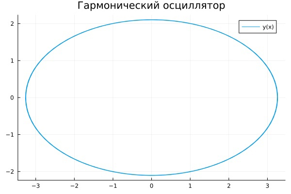
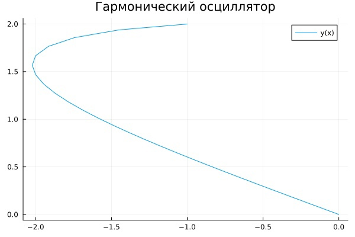
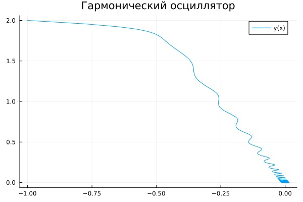
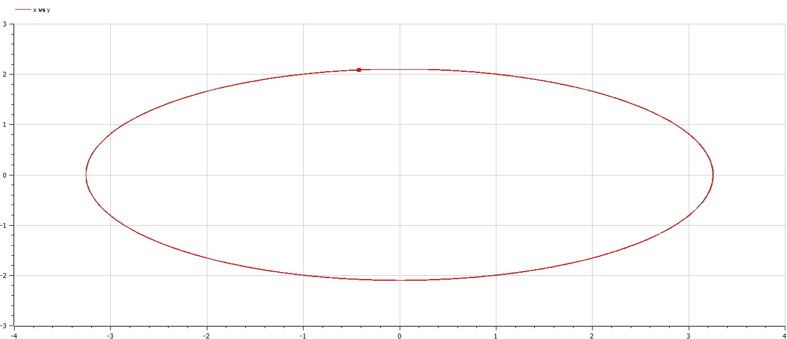
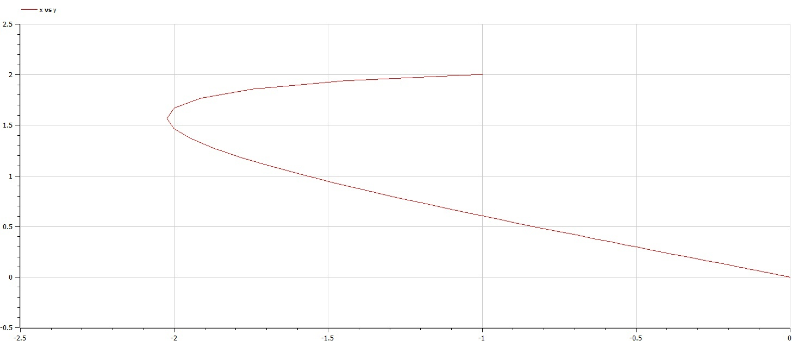
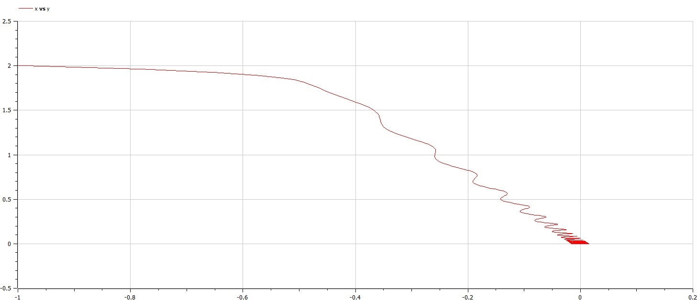

---
## Front matter
title: "Отчет по лабораторной работе №4"
subtitle: "Модель гармонических колебаний"
author: "Смирнов-Мальцев Егор Дмитриевич"

## Generic otions
lang: ru-RU
toc-title: "Содержание"

## Bibliography
bibliography: bib/cite.bib
csl: pandoc/csl/gost-r-7-0-5-2008-numeric.csl

## Pdf output format
toc: true # Table of contents
toc-depth: 2
lof: true # List of figures
lot: true # List of tables
fontsize: 12pt
linestretch: 1.5
papersize: a4
documentclass: scrreprt
## I18n polyglossia
polyglossia-lang:
  name: russian
  options:
	- spelling=modern
	- babelshorthands=true
polyglossia-otherlangs:
  name: english
## I18n babel
babel-lang: russian
babel-otherlangs: english
## Fonts
mainfont: PT Serif
romanfont: PT Serif
sansfont: PT Sans
monofont: PT Mono
mainfontoptions: Ligatures=TeX
romanfontoptions: Ligatures=TeX
sansfontoptions: Ligatures=TeX,Scale=MatchLowercase
monofontoptions: Scale=MatchLowercase,Scale=0.9
## Biblatex
biblatex: true
biblio-style: "gost-numeric"
biblatexoptions:
  - parentracker=true
  - backend=biber
  - hyperref=auto
  - language=auto
  - autolang=other*
  - citestyle=gost-numeric
## Pandoc-crossref LaTeX customization
figureTitle: "Рис."
tableTitle: "Таблица"
listingTitle: "Листинг"
lofTitle: "Список иллюстраций"
lotTitle: "Список таблиц"
lolTitle: "Листинги"
## Misc options
indent: true
header-includes:
  - \usepackage{indentfirst}
  - \usepackage{float} # keep figures where there are in the text
  - \floatplacement{figure}{H} # keep figures where there are in the text
---

# Цель работы

Построить фазовые портеты гармонических колебаний.

# Задание

Смоделировать гармонические колебание:

1. Без затухани и внешних сил.
2. С затуханием.
3. С затуханием и действием внешних сил.

# Теоретическое введение

Движение грузика на пружинке, маятника, заряда в электрическом контуре, а также эволюция во времени многих систем в физике, химии, биологии и других науках при определенных предположениях можно описать одним и тем же дифференциальным уравнением, которое в теории колебаний выступает в качестве
основной модели. Эта модель называется линейным гармоническим осциллятором. Уравнение свободных колебаний гармонического осциллятора имеет следующий вид:
$$
\ddot{x} + 2 \gamma \dot{x} + \omega_0^2 x = 0,
$$
где $x$ -- переменная, описывающая состояние системы (смещение грузика, заряд конденсатора и т.д.), $\gamma$ -- параметр, характеризующий потери энергии (трение в механической системе, сопротивление в контуре), $\omega_0$ -- собственная частота колебаний, t – время.

Это уравнение является линейным однородным дифференциальным уравнением второго порядка и примером линейной динамической системы. При отсутствии потерь в системе получаем уравнение консервативного осциллятора, энергия колебания которого сохраняется во времени.
$$
\ddot{x} + \omega_0^2 x = 0.
$$

Для однозначной разрешимости уравнения второго порядка необходимо задать два начальных условия вида
$$
\begin{cases}
 x(t_0) = x_0 \\
 \dot{x}(t_0)  = y_0.
\end{cases}
$$

Уравнение второго порядка можно представить в виде системы двух уравнений первого порядка:
$$
\begin{cases}
 \dot{x} = y \\
 \dot{y} = -\omega_0^2 x.
\end{cases}
$$

Начальные условия для этой системы примут вид:
$$
\begin{cases}
 x(t_0) = x_0 \\
 y(t_0)  = y_0.
\end{cases}
$$

Независимые переменные x, y определяют пространство, в котором «движется» решение. Это фазовое пространство системы. Поскольку оно двумерно, будем называть его фазовой плоскостью. Значение фазовых координат x, y в любой момент времени полностью определяет состояние системы. Решению уравнения движения как функции времени отвечает гладкая кривая в фазовой плоскости. Она называется фазовой траекторией. Если множество различных решений (соответствующих различным начальным условиям) изобразить на одной фазовой плоскости, возникает общая картина поведения системы. Такую картину, образованную набором фазовых траекторий, называют фазовым портретом

# Выполнение лабораторной работы

## Моделирование в Julia

Для начала введем параметры задачи:

```Julia
w = 2.4;
g = 0;
t = (0, 60)
f(t) = 0
```

Переменная $w$ является квадратом частоты колебаний. Такой смысл был выбран, поскольку нам не дана частота колебаний, а дан сразу ее квадрат. Переменная $g$ характеризует потерю энергии. Переменная $t$ показывает сколько времени моделируется колебание. Функция $f$ характеризует влияние внешних сил.

Далее введем систему дифференциальных уравнений, характеризующую нашу модель.

```Julia
function syst!(dx,x,p,t)
    dx[1] = x[2];
    dx[2] = -w.*x[1] - g .* x[2] - f(t);
end;
```

Теперь введем начальные условия задачи:

```Julia
x0 = [2, -1];
```

Решим систему дифференциальных уравнений первого порядка и запишем $x$-ы в переменную $u_1$, а $y$-и в $u_2$:

```Julia
prob = ODEProblem(syst!, x0, t);
y = solve(prob, Tsit5(), saveat=0.05);
u1 = Vector{Float64}()
u2 = Vector{Float64}()
for i in range(1, length(y.t))
    push!(u1, y.u[i][1]);
    push!(u2, y.u[i][2]);
end;
```

Построим фазовый портет:

```Julia
plot(u1, u2, label = "y(x)", title = "Гармонический осциллятор");
savefig("name.png");
```

Для моего варианта получились следующие графики (рис. [-@fig:001], [-@fig:002], [-@fig:003]).

{ #fig:001 width=70% }

{ #fig:002 width=70% }

{ #fig:003 width=70% }

## Моделирование с помощью Openmodelica

Аналогично первому случаю введем параметры $w$ и $g$:

```Openmodelica
parameter Real w = 3;
parameter Real g = 12;
```

Введем переменные $x, y$, а также $t$, отвечающую за время, и $f$, отвечающую за действие внешних сил:

```Openmodelica
Real x(start=2);
Real y(start=-1);
Real t(start=0);
Real f;
```

Введем систему уравнений, описывающую нашу модель:

```Openmodelica
equation
  der(x) = y;
  der(y) = -w*x - g*y - f;
  f = 0.2*sin(5*t);
  der(t) = 1
```
Для моего варианта получились следующие графики (рис. [-@fig:004], [-@fig:005], [-@fig:006]).

{ #fig:004 width=70% }

{ #fig:005 width=70% }

{ #fig:006 width=70% }

# Выводы

Мы построили фазовые портреты колебаний.

# Список литературы{.unnumbered}

::: {#refs}
:::
