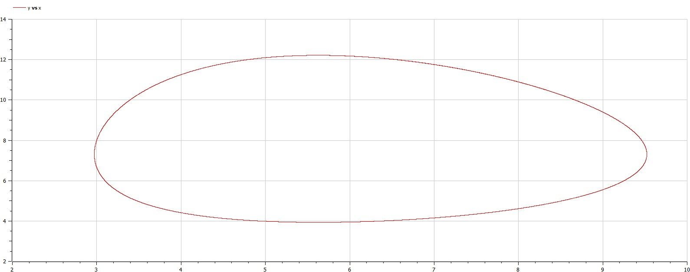

---
## Front matter
lang: ru-RU
title: Лабораторная работа №5
subtitle: Модель Лотки-Вольтерры
author:
  - Смирнов-Мальцев Е. Д.
institute:
  - Российский университет дружбы народов им. Патриса Лумумбу, Москва, Россия
date: 9 марта 2024

## i18n babel
babel-lang: russian
babel-otherlangs: english

## Formatting pdf
toc: false
toc-title: Содержание
slide_level: 2
aspectratio: 169
section-titles: true
theme: metropolis
header-includes:
 - \metroset{progressbar=frametitle,sectionpage=progressbar,numbering=fraction}
 - '\makeatletter'
 - '\beamer@ignorenonframefalse'
 - '\makeatother'


style: |
  section h2 {
    text-align: center;
  }
marp: true

---

# Цель работы

Построить модель Лотки-Вольтерра.

---

# Задание

1. Создать модель по данной системе дифференциальных уравнений:
2. Построить графики измениния числа особей.
3. Найти стационарную точку.

---

# Теоретическое введение

Простейшая модель взаимодействия двух видов типа «хищник-жертва» -- модель Лотки-Вольтерры. Данная двувидовая модель основывается на следующих предположениях:

1. Численность популяции жертв x и хищников y зависят только от времени (модель не учитывает пространственное распределение популяции на занимаемой территории)
2. В отсутствии взаимодействия численность видов изменяется по модели Мальтуса, при этом число жертв увеличивается, а число хищников падает
3. Естественная смертность жертвы и естественная рождаемость хищника считаются несущественными
4. Эффект насыщения численности обеих популяций не учитывается
5. Скорость роста численности жертв уменьшается пропорционально численности хищников

---

# Теоретическое введение

$$
\begin{cases}
 \dot{x} = ax - bxy \\
 \dot{y} = -cy + dxy.
\end{cases}
$$

В этой модели x – число жертв, y - число хищников. Коэффициент a описывает скорость естественного прироста числа жертв в отсутствие хищников, с -- естественное вымирание хищников, лишенных пищи в виде жертв. Вероятность взаимодействия жертвы и хищника считается пропорциональной как количеству жертв, так и числу самих хищников (xy). Каждый акт взаимодействия уменьшает популяцию жертв, но способствует увеличению популяции хищников (члены -bxy и dxy в правой части уравнения).

---

# Теоретическое введение

Математический анализ этой (жесткой) модели показывает, что имеется стационарное состояние, всякое же другое начальное состояние приводит к периодическому колебанию численности как жертв, так и хищников, так что по прошествии некоторого времени система возвращается в начальное состояние.

Стационарное состояние системы (положение равновесия, не зависящее от времени решение) будет в точке: $x_0 = \frac{c}{d}, y_0 = \frac{a}{b}$. При малом отклонении от положения равновесия численности как хищника, так и жертвы с течением времени не возвращаются к равновесным значениям, а совершают периодические колебания вокруг стационарной точки. Амплитуда колебаний и их период определяется начальными значениями численностей особей. Колебания совершаются в противофазе.

---

# Моделирование в Julia

Для начала введем параметры задачи:

```Julia
a = 0.19;
b = 0.026;
c = 0.18;
d = 0.032;
t = (0, 400);
```

Переменные $a, d$ являются коэффициентами смертности, а $b, c$ -- коэффициенты рождаемости.

---

# Моделирование в Julia

Далее введем систему дифференциальных уравнений, характеризующую нашу модель.

```Julia
function syst!(dx,x,p,t)
    dx[1] = -a.*x[1] + b .* x[1] * x[2];
    dx[2] =  c.*x[2] - d .* x[1] * x[2];
end;
```

---

# Моделирование в Julia

Теперь введем начальные условия задачи:

```Julia
x0 = [3, 8];
```

---

# Моделирование в Julia

Решим систему дифференциальных уравнений первого порядка и запишем $x$-ы в переменную $u_1$, а $y$-и в $u_2$:

```Julia
prob = ODEProblem(syst!, x0, t);
y = solve(prob, Tsit5(), saveat=0.01);
u1 = Vector{Float64}()
u2 = Vector{Float64}()
for i in range(1, length(y.t))
    push!(u1, y.u[i][1]);
    push!(u2, y.u[i][2]);
end;
```

---

# Моделирование в Julia

Построим график зависимости количества жертв от количества хищников:

```Julia
plot(u1, u2, label = "", title = "Модель Лотки-Вольтерра");
savefig("name.png");
```

Также построим график изменения числа особей в популяциях:

```Julia
t1 = [0:0.01:400]
plot(t1, [u1, u2], label = ["Хищники" "Жертвы"], title = "Изменение числа особей в популяциях");
savefig("name.png");
```

---

# Моделирование в Julia

Зависимость количества жертв от количества хищников.

## 

---

# Моделирование в Julia

Изменение числа особей в популяциях.

## 

---

# Моделирование в Openmodelica

Аналогично первому случаю введем параметры $a, b, c$ и $d$:

```Openmodelica
parameter Real a = 0.19;
parameter Real b = 0.026;
parameter Real c = 0.18;
parameter Real d = 0.032;
```

---

# Моделирование в Openmodelica

Введем переменные $x, y$:

```Openmodelica
Real x(start=3);
Real y(start=8);
```

Введем систему уравнений, описывающую нашу модель:

```Openmodelica
equation
  der(x) = -a*x + b*x*y;
  der(y) =  c*y + d*x*y;
```

---

# Моделирование в Openmodelica

Зависимость количества жертв от количества хищников.

## 

---

# Моделирование в Openmodelica

Изменение числа особей в популяциях.

## 

---

# Стационарная точка

$$
x_0 = \frac{c}{d} = 0.5625, 
y_0 = \frac{a}{b} \approx 7.3.
$$

---

# Выводы

Мы построили модель Лотки-Вольтерра и нашли стационарную точку.