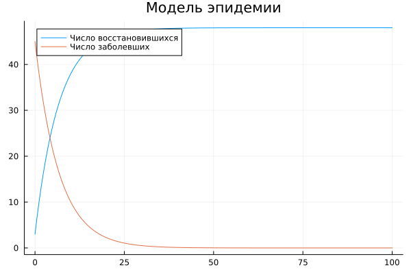
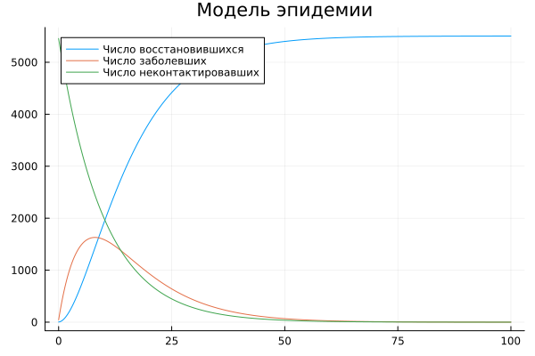
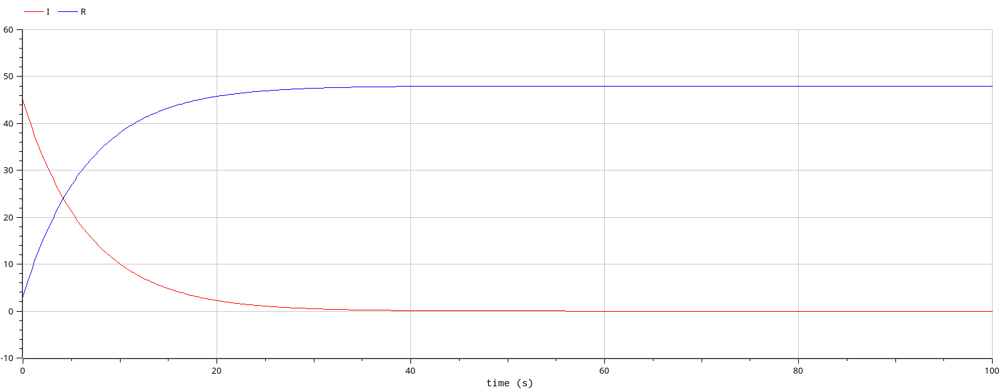
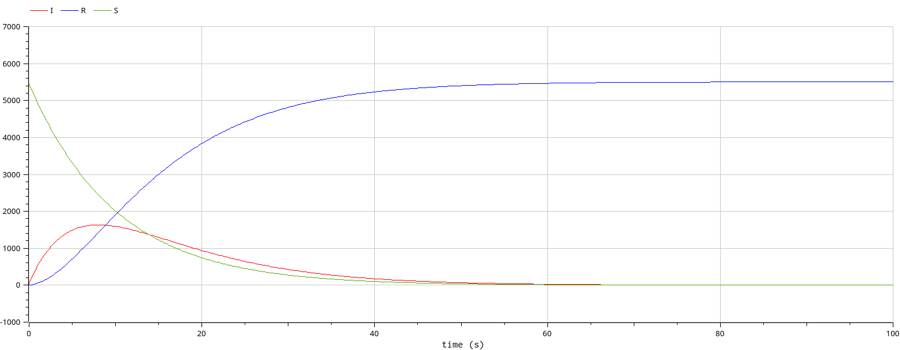

<style>
section::after {
  content: attr(data-marpit-pagination) '/' attr(data-marpit-pagination-total);
}
</style>

<style>
    section{
        text-align: justify;
        font-size: 25px;
    }
</style>
# Задача об эпидемии <!-- fit -->
<style>
    h2{
        font-size: 30px;
        text-align: center;
    }
    h3{
        font-size: 20px;
        text-align: center;
    }
</style>
## Смирнов-Мальцев Егор Дмитриевич

### 1032212272@pfur.ru

### Российский университет дружбы народов им. Патриса Лумумбу, Москва, Россия

---

# Цель работы

Построить модель эпидемии в двух случаях:

1. Зараженные изолированы
2. Зараженных не удается изолировать

---

# Задание

1. Построить модели эпидемии в Julia
2. Построить модели эпидемии в Openmodelica

---

# Теоретическое введение

Рассмотрим простейшую модель эпидемии. Предположим, что некая изолированная популяция, состоящая из $N$ особей подразделяется на три группы. Первая группа -- это восприимчивые к болезни, но пока здоровые особи. Обозначим их через $S(t)$. Вторая группа –- это число инфицированных особей, которые являются распространителями инфекции. Обозначим их I(t). А третья группа, обозначающаяся через R(t) –- здоровые особи с иммунитетом к болезни. До того, как число заболевших не превышает критического значения $I^* $, считаем, что все больные изолированы и не заражают здоровых. Когда $I(t) > I^* $, тогда инфицирование способны заражать восприимчивых к болезни особей. Таким образом, скорость изменения числа $S(t)$ меняется по следующему закону:
$$
\begin{cases}
 \dot{S(t)} = 0, I(t) \leq I^* \\
 \dot{S(t)} = -aS(t), I(t) > I^* .
\end{cases}
$$

---

# Теоретическое введение

Поскольку каждая восприимчивая к болезни особь, которая, в конце концов, заболевает, сама становится инфекционной, то скорость изменения числа инфекционных особей представляет разность за единицу времени между заразившимися и теми, кто уже болеет и лечится, т.е.:
$$
\begin{cases}
 \dot{I(t)} = -bI(t), I(t) \leq I^* \\
 \dot{I(t)} = aS(t) - bI(t), I(t) > I^* .
\end{cases}
$$

---

# Теоретическое введение

А скорость изменения выздоравливающих особей (при этом приобретающие иммунитет к болезни):
$$
\dot{R(t)} = bI(t).
$$

---

# Теоретическое введение

Для того, чтобы решения соответствующих уравнений определялось однозначно, необходимо задать начальные условия. Считаем, что в момент времени $t_0$ нет особей с иммунитетом к болезни ($R(t_0)=0$), а
число инфицированных и восприимчивых к болезни особей: $$I(t_0)=I_0, S(t_0) = S_0$$.

---

# Выполнение лабораторной работы

---

# Моделирование в Julia

Для начала введем параметры задачи:

```Julia
a = 0.1;
b = 0.15;
t = (0, 100);
```

Переменные $a, b$ являются коэффициентами заболеваемости и выздоровления соответственно.

---

# Моделирование в Julia

Далее введем систему дифференциальных уравнений, характеризующую нашу модель.

```Julia
function syst!(dx,x,p,t)
    dx[1] = a*x[3]-b.*x[1];
    dx[2] = b.*x[1];
    dx[3] = -a*x[3];
end;
```

---

# Моделирование в Julia

Теперь введем начальные условия задачи:

```Julia
x0 = [45, 3, 5457];
```

---

# Моделирование в Julia

Решим систему дифференциальных уравнений первого порядка и запишем $I(t)$ в переменную $u_1$, $R(t)$ -- в $u_2$, а $S(t)$ в $u_3$:

```Julia
prob = ODEProblem(syst!, x0, t);
y = solve(prob, Tsit5(), saveat=0.2);
u1 = Vector{Float64}()
u3 = Vector{Float64}()
u2 = Vector{Float64}()
for i in range(1, length(y.t))
    push!(u1, y.u[i][1]);
    push!(u2, y.u[i][2]);
    push!(u3, y.u[i][3]);
end;
```

---

# Моделирование в Julia

Построим график зависимости количества в каждой из групп от времени:

```Julia
t1 = [0:0.2:100];
plot(t1, [u2, u1, u3], label = ["Число восстановившихся" "Число заболевших" "Число неконтактировавших"], title = "Модель эпидемии");
savefig("name.png")
```

---

# Моделирование в Julia

Число восстановившихся и болеющих при изоляции заболевших:

## 

---

# Моделирование в Julia

Число восстановившихся и болеющих при невозможности изоляции заболевших:

## 

---

# Моделирование с помощью Openmodelica

Аналогично первому случаю введем параметры $a, b$, а также параметр $N$ -- количество особей в популяции:

```Openmodelica
parameter Real N = 5505;
parameter Real a = 0.10;
parameter Real b = 0.15;
```

---

# Моделирование с помощью Openmodelica

Введем переменные $I, R, S$:

```Openmodelica
Real I(start=45);
Real R(start=3);
Real S(start=5457);
```

---

# Моделирование с помощью Openmodelica

Введем систему уравнений, описывающую нашу модель:

```Openmodelica
equation
  der(I) = a*S-b*I;
  der(R) = b*I;
  der(S) = -a*S;
```

---

# Моделирование с помощью Openmodelica

Число восстановившихся и болеющих при изоляции заболевших:

## 

---

# Моделирование с помощью Openmodelica

Число восстановившихся и болеющих при невозможности изоляции заболевших:

## 

---

# Выводы

Была построена модель эпидемии. В случае изоляции зоболевших число зараженных сразу падает. В случае невозможности изоляции число зараженных в какой-то момент достигает своего пика, а потом падает.