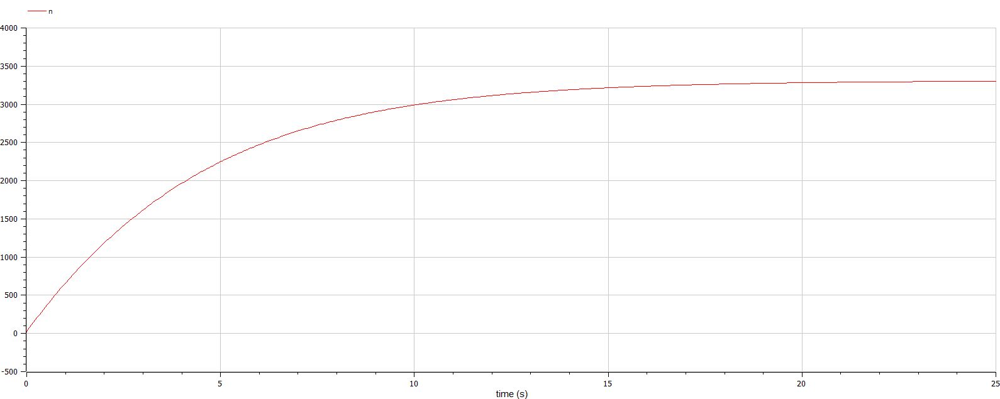
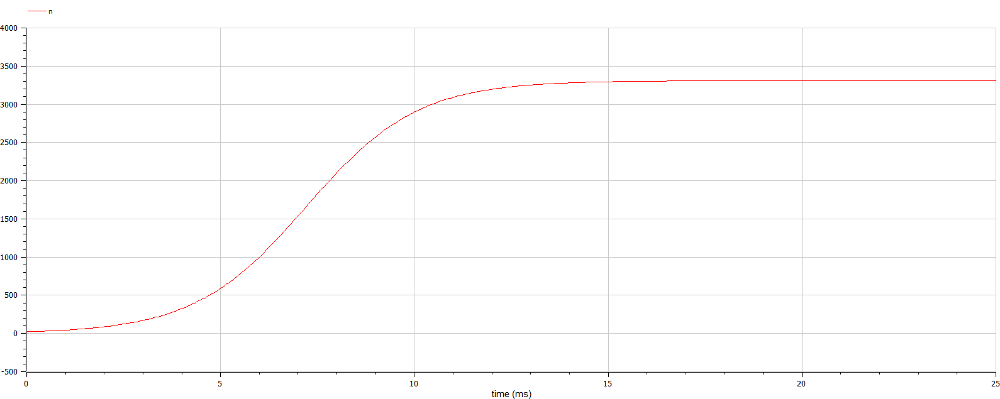
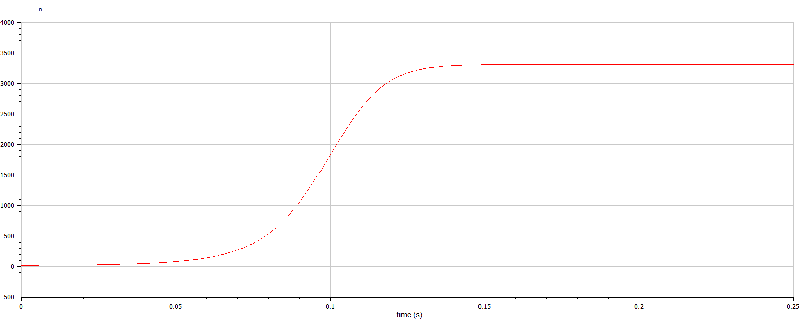

<style>
section::after {
  content: attr(data-marpit-pagination) '/' attr(data-marpit-pagination-total);
}
</style>

<style>
    section{
        text-align: justify;
        font-size: 25px;
    }
</style>
# Моделирование рекламной компании <!-- fit -->
<style>
    h2{
        font-size: 30px;
        text-align: center;
    }
    h3{
        font-size: 20px;
        text-align: center;
    }
</style>
## Смирнов-Мальцев Егор Дмитриевич

### 1032212272@pfur.ru

### Российский университет дружбы народов им. Патриса Лумумбу, Москва, Россия

---

# Цель работы

Построить модели распространения рекламы.

---

# Задание

1. Создать модели распространения рекламы с большой интенсивностью, но малой сарафанностью.
2. Создать модели распространения рекламы с малой интенсивностью, но большой сарафанностью.
3. Создать модели распространения рекламы с изменяющемися интенсивностью и сарафанностью.

---

# Теоретическое введение

Организуется рекламная кампания нового товара или услуги. Необходимо, чтобы прибыль будущих продаж с избытком покрывала издержки на рекламу. Вначале расходы могут превышать прибыль, поскольку лишь малая часть потенциальных покупателей будет информирована о новинке. Затем, при увеличении числа продаж, возрастает и прибыль, и, наконец, наступит момент, когда рынок насытится, и рекламировать товар станет бесполезным. Предположим, что торговыми учреждениями реализуется некоторая продукция, о которой в момент времени $t$ из числа потенциальных покупателей $N$ знает лишь $n$ покупателей. Для ускорения сбыта продукции запускается реклама по радио, телевидению и другим средствам массовой информации. После запуска рекламной кампании информация о продукции начнет распространяться среди потенциальных покупателей путем общения друг с другом. Таким образом, после запуска рекламных объявлений скорость изменения числа знающих о продукции людей пропорциональна как числу знающих о товаре покупателей, так и числу покупателей о нем не знающих. 

---

# Теоретическое введение

Модель рекламной кампании описывается следующими величинами:

1. Cкорость изменения со временем числа потребителей, узнавших о товаре и готовых его купить: $\dot{n}$.
2. Время ($t$), прошедшее с начала рекламной кампании.
3. Число уже информированных клиентов $n(t)$.
4. Число $N$ - общее количество потенциальных платежеспособных покупателей
5. Интенсивность рекламной кампании $a_1(t)$. Зависит от затрат на рекламу в данный момент времени.
6. Интенсивность распространения знания о товаре через сарфанное радио $a_2(t)$.

---

# Теоретическое введение

Математическая модель распространения рекламы описывается уравнением:

$$\dot{n} = (a_1(t) + a_2(t)n(t)) \cdot (N - n(t)).$$

---

# Выполнение лабораторной работы <!-- fit -->

---

# Моделирование в Julia

Для начала введем параметры задачи:

```Julia
a1(t) = 0.511*sin(t)
a2(t) = 0.311*sin(t)
t = (0, 0.25)
N = 3310
```

Функции $a1, a2$ являются коэффициентами интенсивности рекламной компании и сарафанного радио соответственно, $N$ -- общее число потенциальных клиентов а $t$ -- время.

---

# Моделирование в Julia

Далее введем систему дифференциальных уравнений, характеризующую нашу модель.

```Julia
function syst!(dx,x,p,t)
    dx[1] = (a1(t) .+ a2(t).*x[1]).*(N.-x[1]);
end;
```

---

# Моделирование в Julia

Теперь введем начальные условия задачи:

```Julia
x0 = [22];
```

---

# Моделирование в Julia

Решим дифференциальное уравнение первого порядка и запишем число знающих о товаре клиентов в переменную $u_1$:

```Julia
prob = ODEProblem(syst!, x0, t);
y = solve(prob, Tsit5(), saveat=0.001);
u1 = Vector{Float64}()
u2 = Vector{Float64}()
mx = 0.0
it = 0
for i in range(1, length(y.t))
    push!(u1, y.u[i][1]);
end;
```

---

# Моделирование в Julia

Построим график зависимости количества знающих о товаре людей от времени:

```Julia
t1 = [0:0.001:0.25];
plot(t1, u1, label = "Число осведомленных", title = "Распространение рекламы");
xlabel!("t")
ylabel!("n")
savefig("name.png")
```

---

# График при большой интенсивности рекламной компании

## 

---

# График при большой интенсивности сарафанного радио

## 

---

# График при изменяющихся интенсивностях

## 

---

# Моделирование с помощью Openmodelica

Введем параметр $N$:

```Openmodelica
parameter Real N = 3310;
```

---

# Моделирование с помощью Openmodelica

Введем переменные $n, a_1, a_2,t$:

```Openmodelica
Real n(start=22);
Real t(start=0);
Real a1(start=0.511);
Real a2(start=0.311);
```

---

# Моделирование с помощью Openmodelica

Введем систему уравнений, описывающую нашу модель:

```Openmodelica
equation
  der(n) = (a1+a2*n)*(N-n);
  der(t) = 1;
  a1 = 0.511*sin(t);
  a2 = 0.311*sin(t); 
```

---

# График при большой интенсивности рекламной компании

## 

---

# График при большой интенсивности сарафанного радио

## 

Максимальная эффективность рекламы достигается при $t=0.0073$.

---

# График при изменяющихся интенсивностях

## 

---

# Выводы

Мы построили модели распространения рекламы. Из них можно увидеть, что эффективность сарафанного радио выше эффективности прямой рекламной компании.