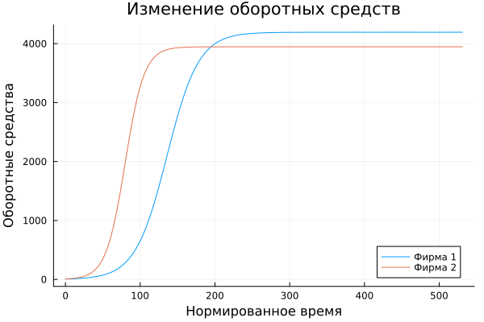
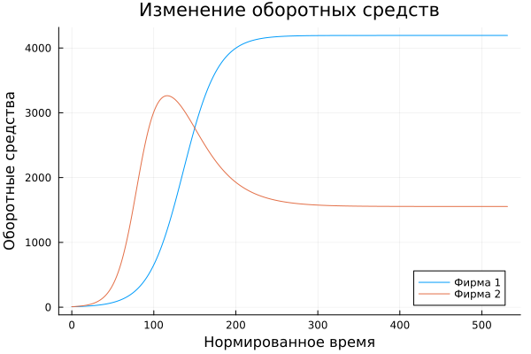
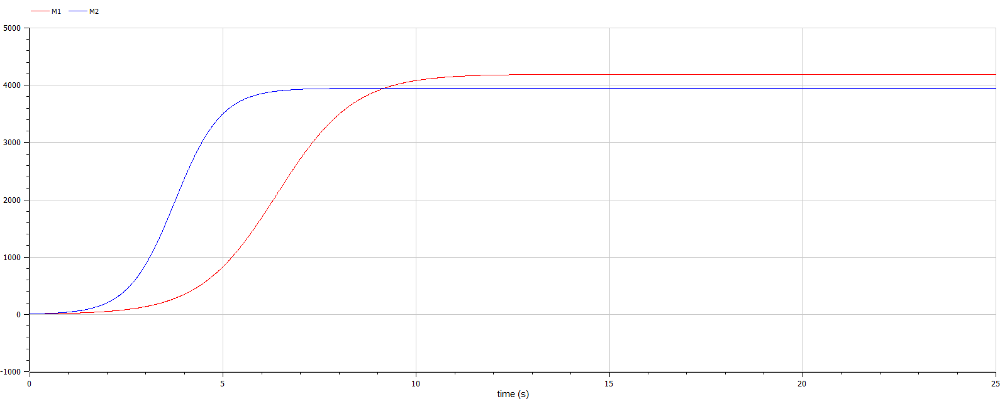

<style>
section::after {
  content: attr(data-marpit-pagination) '/' attr(data-marpit-pagination-total);
}
</style>

<style>
    section{
        text-align: justify;
        font-size: 25px;
    }
</style>
# Моделирование конкуренции 2 фирм <!-- fit -->
<style>
    h2{
        font-size: 30px;
        text-align: center;
    }
    h3{
        font-size: 20px;
        text-align: center;
    }
</style>
## Смирнов-Мальцев Егор Дмитриевич

### 1032212272@pfur.ru

### Российский университет дружбы народов им. Патриса Лумумбу, Москва, Россия

---

# Цель работы

Построить модели конкуренции двух фирм.

---

# Задание

1. Создать модель конкуренции 2 фирм без учета социально-психологических факторов.
2. Создать модель конкуренции 2 фирм с учетом социально-психологических факторов.

---

# Теоретическое введение

Рассмотрим две фирмы, производящие взаимозаменяемые товары одинакового качества и находящиеся в одной рыночной нише. Последнее означает, что у потребителей в этой нише нет априорных предпочтений, и они приобретут тот или иной товар, не обращая внимания на знак фирмы. В этом случае, на рынке устанавливается единая цена, которая определяется балансом суммарного предложения и спроса. Иными словами, в рамках нашеймодели конкурентная борьба ведётся только рыночными методами. То есть, конкуренты могут влиять на противника путем изменения параметров своего производства: себестоимость, время цикла, но не могут прямо вмешиваться в ситуацию на рынке («назначать» цену или влиять на потребителей каким-либо иным способом.)

---

# Теоретическое введение

Уравнения динамики оборотных средств запишем в виде:
$$
\begin{cases}
\dfrac{dM_1}{dt} = -\frac{M_1}{\tau_1}+N_1q(1-\frac{p}{p_{cr}}p-\kappa_1)
\dfrac{dM_2}{dt} = -\frac{M_2}{\tau_1}+N_2q(1-\frac{p}{p_{cr}}p-\kappa_2),
\end{cases}
$$
где $\kappa_1$ и $\kappa_2$ меры эластичности функции спроса по цене, $p$ -- стоимость продукта, $p_{cr}$ критическая стоимость продукта, $q$ -- максимальная потребность одного человека в продукте в единицу времени, $N$ -- число потребителей производимого продукта, $M$ -- оборотные средства продукта.

---

# Теоретическое введение

Второй случай -- когда используются психологические факторы. Модель в этом случае будет выглядеть следующим образом:
$$
\begin{cases}
\dfrac{dM_1}{dt} = -\frac{M_1}{\tau_1}+N_1q(1-\frac{p}{p_{cr}}p-\kappa_1)
\dfrac{dM_2}{dt} = -\frac{M_2}{\tau_1}+N_2q(1-\frac{p}{p_{cr}}p-\kappa_2),
\end{cases}
$$

---

# Выполнение лабораторной работы <!-- fit -->

---

# Моделирование в Julia

Для начала введем параметры задачи:

```Julia
p_cr = 27.0;
N=37.0;
q=1.0;
tau_1 = 17.0;
tau_2 = 16.0;
p_1_tilda = 15;
p_2_tilda = 12;

a_1 = p_cr/((tau_1)^2*(p_1_tilda)^2*N*q);
a_2 = p_cr/((tau_2)^2*(p_2_tilda)^2*N*q);
b = p_cr/((tau_1)^2*(p_1_tilda)^2*(tau_2)^2*(p_2_tilda)^2*N*q);;
c_1 = (p_cr-p_1_tilda)/tau_1/p_1_tilda;
c_2 = (p_cr-p_2_tilda)/tau_2/p_2_tilda;
t = (0, 25)
```

---

# Моделирование в Julia

Далее введем систему дифференциальных уравнений, характеризующую нашу модель.

```Julia
function syst!(dx,x,p,t)
    dx[1] = x[1]-b/c_1*x[1]*x[2]-a_1/c_1*(x[1])^2;
    dx[2] = c_2/c_1*x[2]-(b/c_1+0.00024)*x[1]*x[2]-a_2/c_1*(x[2])^2;
end;
```

---

# Моделирование в Julia

Теперь введем начальные условия задачи:

```Julia
x0 = [7, 7.7];
```

---

# Моделирование в Julia

Решим дифференциальное уравнение первого порядка и запишем оборотные средства первой и второй фирм в переменные $u_1$ и $u_2$ соответственно:

```Julia
prob = ODEProblem(syst!, x0, t);
y = solve(prob, Tsit5(), saveat=0.01);
u1 = Vector{Float64}()
u2 = Vector{Float64}()
for i in range(1, length(y.t))
    push!(u1, y.u[i][1]);
    push!(u2, y.u[i][2]);
end;
```

---

# Моделирование в Julia

Построим график зависимости количества оборотных средств от времени:

```Julia
t1 = [0:0.01:25];
plot(t1./c_1, [u1, u2], label = ["Фирма 1" "Фирма 2"], title = "Изменение оборотных средств");
xlabel!("Нормированное время")
ylabel!("Оборотные средства")
savefig("name.png")
```

---

# Конкуренция фирм без учета психологических факторов

## 

---

# Конкуренция фирм с учетом психологических факторов

## 

---

# Моделирование с помощью Openmodelica

Введем параметры задачи:

```Openmodelica
parameter Real p_cr = 27.0;
parameter Real N=37.0;
parameter Real q=1.0;
parameter Real tau_1 = 17.0;
parameter Real tau_2 = 16.0;
parameter Real p_1_tilda = 15;
parameter Real p_2_tilda = 12;

parameter Real a_1 = p_cr/((tau_1)^2*(p_1_tilda)^2*N*q);
parameter Real a_2 = p_cr/((tau_2)^2*(p_2_tilda)^2*N*q);
parameter Real b = p_cr/((tau_1)^2*(p_1_tilda)^2*(tau_2)^2*(p_2_tilda)^2*N*q);
parameter Real c_1 = (p_cr-p_1_tilda)/tau_1/p_1_tilda;
parameter Real c_2 = (p_cr-p_2_tilda)/tau_2/p_2_tilda;
```

---

# Моделирование с помощью Openmodelica

Введем переменные:

```Openmodelica
Real M1(start=7);
Real M2(start=7.7);
```

---

# Моделирование с помощью Openmodelica

Введем систему уравнений, описывающую нашу модель:

```Openmodelica
equation
  der(M1) = M1-b/c_1*M1*M2-a_1/c_1*(M1)^2;
  der(M2) = c_2/c_1*M2-(b/c_1)*M1*M2-a_2/c_1*(M2)^2; 
```

---

# Конкуренция фирм без учета психологических факторов

## 

---

# Конкуренция фирм с учетом психологических факторов

## 

---

# Выводы

Мы построили модели конкуренции 2 фирм.