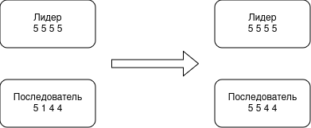
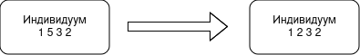
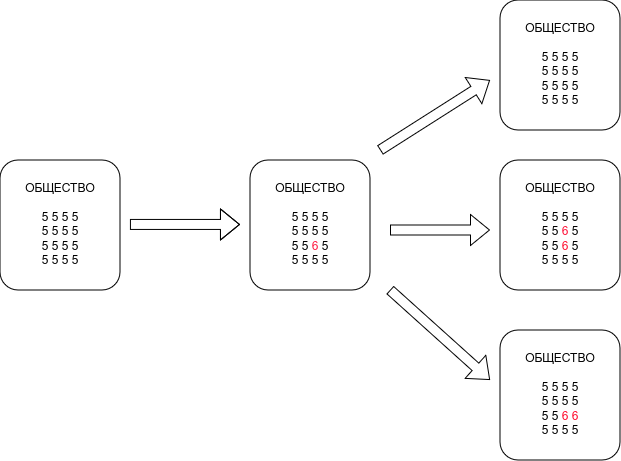
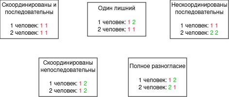
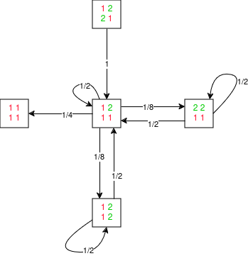

# Модель Беднар <!-- fit -->

## Смирнов-Мальцев Егор Дмитриевич

### 1032212272@pfur.ru

### Российский университет дружбы народов им. Патриса Лумумбу, Москва, Россия

---

# Вводная часть

Одной из важных задач гуманитарных наук является моделирование поведения людей. Для ее решения существует множество математических моделей. Этот доклад посвящен одной из них. Данную модель предложила американский профессор политических наук Дженна Беднар и ее команда. В этой модели выделяются характеристики людей и моделируются их изменения, спровоцированные влиянием общества и желанием человека быть последовательным.

---

# Принципы построения модели Беднар

Модель Беднар строится на двух основных идеях.

1. Идея согласованности. Люди, во время социализации, перенимают примеры поведения от своих знакомых.
2. Идея последовательности. Человек стремится сохранять свои привычки находясь в различном окружении.

---

# Идея согласованности

Последователь меняет свою характеристику, чтобы быть больше похожим на лидера.

## 

---

# Идея последовательности

Человек меняет свою характеристику, чтобы быть последовательным.

## 

---

# Внесение "ошибки" в модель

Ожидается, что модель с такими правилами в итоге получит, что все люди ведут себя скоординированно и последовательно. Однако, в реальности такое не происходит. Поэтому необходимо добавить еще один элемент в модель Беднар: ошибки.

---

# Влияние ошибки

Пусть общество уже унифицировано. После того, как у одного человека изменилась характеристика вследствие некоторой "ошибки", эта характеристика может верунть свое значение, а может продолжить распространяться.

## 

---

# Простейший пример модели Беднар

Приведем модели, в которой всего 2 человека, 2 характеристики и 2 возможных значения для этих характеристик. У нее есть следующие типы состояний:

## 

---

# Граф переходов модели Беднар

На рисунке представлен граф переходов модели Маркова. Можно заметить, что существует состояние, из которого нельзя выбраться.

## 

---

# Вывод

Согласно этой модели люди живущие в одном обществе должны постепенно унифицироваться. Отчасти это и происходит. Однако, модель также и показывает, что благодаря постоянно совершающимся "ошибкам", таким как новые изобретения, желание выделиться и т.п. этот процесс замедляется и общество остается достаточно разнородным.