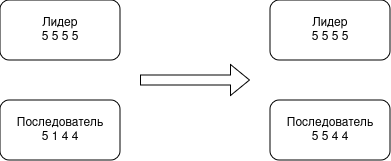
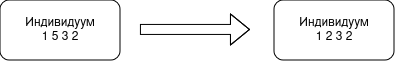
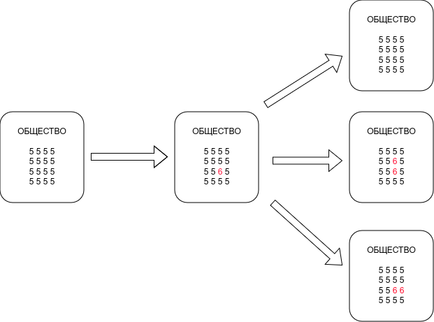
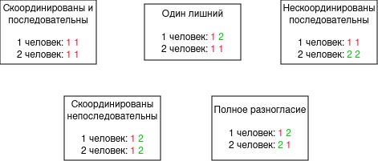

---
## Front matter
title: "Доклад"
subtitle: "Модель Беднар"
author: "Смирнов-Мальцев Егор Дмитриевич"

## Generic otions
lang: ru-RU
toc-title: "Содержание"

## Bibliography
bibliography: bib/cite.bib
csl: pandoc/csl/gost-r-7-0-5-2008-numeric.csl

## Pdf output format
toc: true # Table of contents
toc-depth: 2
lof: true # List of figures
lot: true # List of tables
fontsize: 12pt
linestretch: 1.5
papersize: a4
documentclass: scrreprt
## I18n polyglossia
polyglossia-lang:
  name: russian
  options:
	- spelling=modern
	- babelshorthands=true
polyglossia-otherlangs:
  name: english
## I18n babel
babel-lang: russian
babel-otherlangs: english
## Fonts
mainfont: PT Serif
romanfont: PT Serif
sansfont: PT Sans
monofont: PT Mono
mainfontoptions: Ligatures=TeX
romanfontoptions: Ligatures=TeX
sansfontoptions: Ligatures=TeX,Scale=MatchLowercase
monofontoptions: Scale=MatchLowercase,Scale=0.9
## Biblatex
biblatex: true
biblio-style: "gost-numeric"
biblatexoptions:
  - parentracker=true
  - backend=biber
  - hyperref=auto
  - language=auto
  - autolang=other*
  - citestyle=gost-numeric
## Pandoc-crossref LaTeX customization
figureTitle: "Рис."
tableTitle: "Таблица"
listingTitle: "Листинг"
lofTitle: "Список иллюстраций"
lotTitle: "Список таблиц"
lolTitle: "Листинги"
## Misc options
indent: true
header-includes:
  - \usepackage{indentfirst}
  - \usepackage{float} # keep figures where there are in the text
  - \floatplacement{figure}{H} # keep figures where there are in the text
---

# Введение

Одной из важных задач гуманитарных наук является моделирование поведения людей. Для ее решения существует множество математических моделей. Этот доклад посвящен одной из них. Данную модель предложила американский профессор политических наук Дженна Беднар и ее команда. В этой модели выделяются характеристики людей и моделируются их изменения, спровоцированные влиянием общества и желанием человека быть последовательным.

# Описание модели

Модель Беднар строится на двух основных идеях.

1. Идея согласованности. Люди, во время социализации, перенимают примеры поведения от своих знакомых. Таким образом, происходит унификация всех индивидуумов внутри одной общества. Эта идея проиллюстрирована на рис. [-@fig:001]. Цифрами указаны характеристики людей. Последователь перенимает вторую характеристику у лидера, чтобы быть больше на него похожим.
{ #fig:001 width=70% }
2. Идея последовательности. Человек стремится сохранять свои привычки находясь в разичном окружении. Действительно, каждый индивидуум одновременно состоит в большом количестве сообществ. Например, он состоит в спортивной команде, и у них принято давать пять после удачного действия. Тогда человек привыкнет к такому жесту и начнет его воспроизводить и вне команды. Эта идея проиллюстрирована на рис. [-@fig:002]. Индивидуум делает свою вторую характеристику более похожей на первую и третью.
{ #fig:002 width=70% }

Ожидается, что модель с такими правилами в итоге получит, что все люди ведут себя скоординированно и последовательно. То есть в какой-то момент все люди станут одинаковыми. Однако, в реальности такое не происходит. Поэтому необходимо добавить еще один элемент в модель Беднар: ошибки. Люди постоянно пробуют что-то новое, превносят какие-то инновации. И даже если процент таких людей невелик, они создают достаточно высокий уровень разнородности внутри общества. Данный процесс продемонстрирован на рис. [-@fig:003]. Шестерка на этом рисунке -- неожиданно возникшая ошибка. С одной стороны, она может быть сразу удалена из-за влияния общества. Однако, она может начать распространяться,делая общество менее однородным.
{ #fig:003 width=70% }

Рассмотрим данную модель подробнее на простом примере. Пусть у нас есть два человека, у каждого по две характеристики и у обеих характеристик 2 состояния. Назовем эту модель "2-2-2". Все ее состояния делятся на 5 типов. Они изображены на рис. [-@fig:004]. У типа "один лишний" -- восемь возможных состояний, у остальных типов -- по два.
{ #fig:004 width=70% }

На рис. [-@fig:005] изображены вероятности переходов из каждого типа состояний в другие. Получается цепь Маркова со стоковым состоянием. Понятно, что в связи с небольшим количеством параметров система очень быстро переходит в сток. Однако, если добавить ошибку, то есть предположить, что с небольшой вероятностью характеристика меняется случайно, а не в соответствии с идеями согласованности и последовательности, то скорость стабилизации общества падает.

# Выводы

Согласно этой модели люди живущие в одном обществе должны постепенно унифицироваться. Отчасти это и происходит. Однако, модель также и показывает, что благодаря постоянно совершающимся "ошибкам", таким как новые изобретения, желанию выделиться и т.п. этот процесс замедляется и общество остается достаточно разнородным.

# Список литературы{.unnumbered}

::: {#refs}
:::
